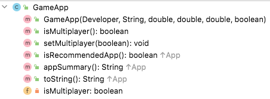

# GameApp class

The responsibility for this *concrete* class is to extend App and implement the class for an GameApp.  The UML is here:

NOTES: 
 
- You may add additional instance fields of your choice (for extra credit!).  If you do so, the method list and parameters for existing methods will change/grow.  
- The **Hierarchy Overview** tab has generic information on coding constructors, getters, setters and toString.  The information below is just the specifics related to this class.

---

## Fields

There is one private field in this class:

- *isMultiplayer* : This is either true or false, with a default value of false. 

## Constructor

There is one constructor for this class. The parameter list for this constructor should be the same as the parameter list for the App class but with the additional field (isMultiplayer).  The constructor should call the superclass constructor and also instantiate the multiplayer field.

## Abstract method

isRecommendedApp - this method returns a boolean indicating if the app is recommended or not.  The algorithm for recommending a GameApp is:

~~~
        // Algorithm - app is recommended if the following applies:
        //      isMultiplayer is true
        //      rating is 4.0 or more
~~~

## JUnit Test Class

You are asked to write the Test Class for GameApp. You should use the test class for EducationApp as imspiration. 