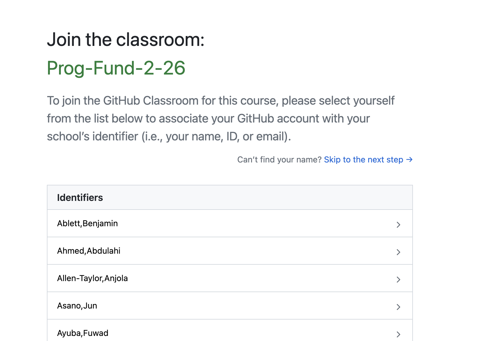
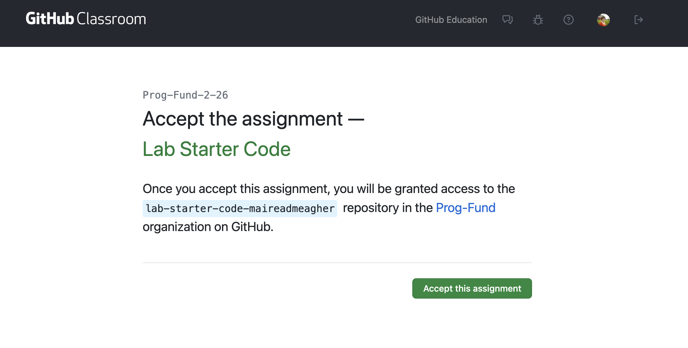
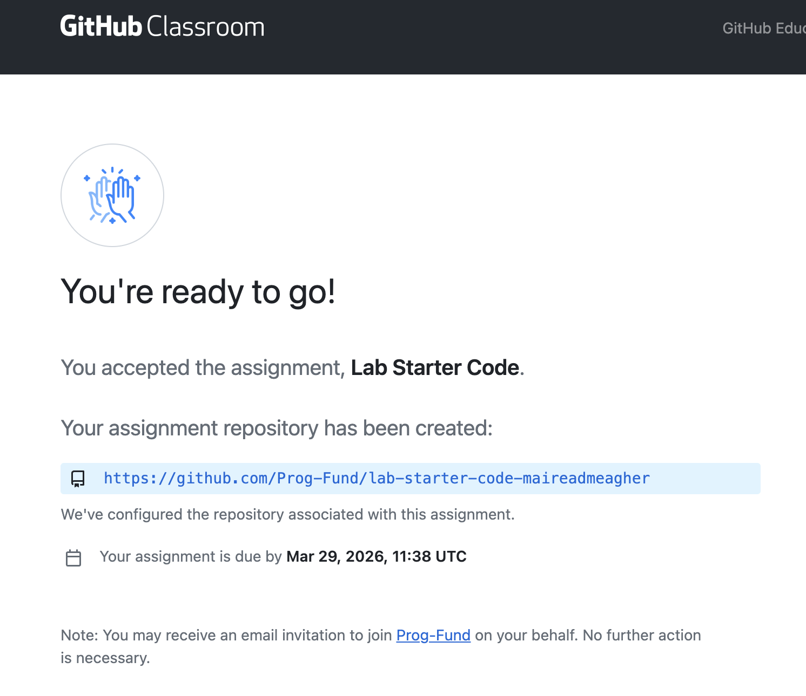

# Accepting the Assignment

The formative assignment is called **LabStarterCode**.

To start working on it, click on this invite link:

<https://classroom.github.com/a/wktF1AFD>

You should see a list of names - pick yours and move to next part. 

You will be prompted to authorise GitHub classroom - accept this and then you will be invited to Accept the Assignment

When you accept this, you are told that you don't have access. 
You should go to the email address you signed up with for GitHub, you should get an email from GitHub classroom inviting you to join the classroom.
Accept the invitation.

Once you do this, you will be redirected to join the classroom:

Then *accept this assignment*:

When you refresh the page, you should see that a repo has been created for you (your name will be at the end of the repo url and the name of the repo will be the same as the name of the assignment):

