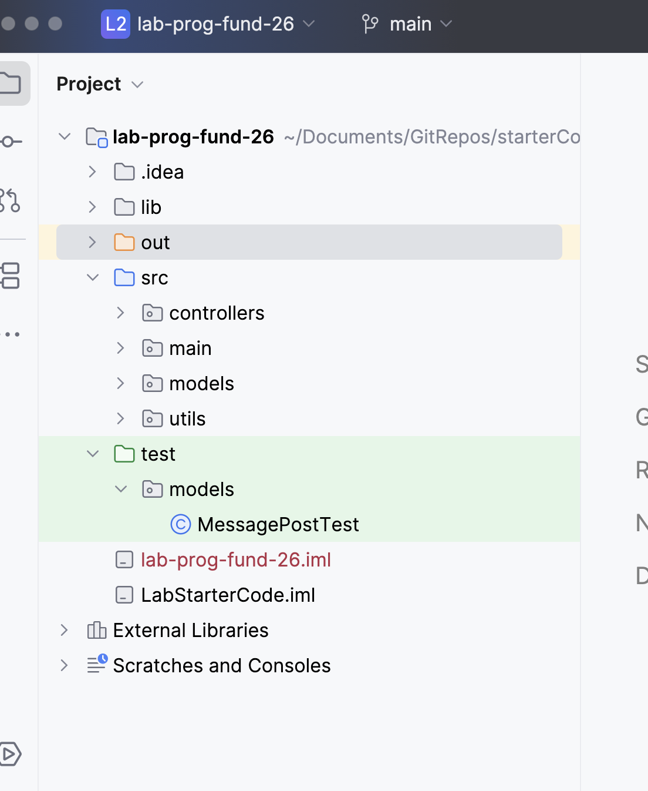

# Project Structure - src

In the screen shot below, you can see that we have two main folders:

- `src` coloured blue
- `test` coloured green. (if it is not marked green, Change it via -> Mark Directory)

## src folder

This is a version of the Social Media App from this semester.  

## src - MessagePost

We will be working on the tests for this class only for this lab.

 
You are asked to add to the tests in MessagePostTest.java as per the **TODO** comments.

While you are working, please commit and push regularly. WHen you are finished, please do a final push. 

