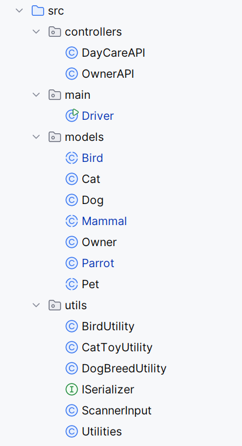
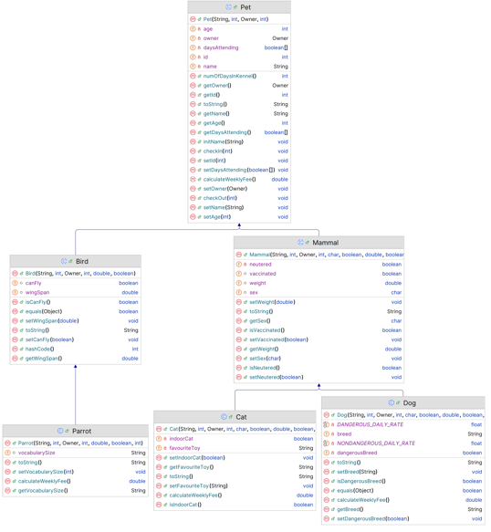

# Classes Overview

The System has the following *src* classes:

## Starting the New Project

[Starter Code](archives/KennelCareStarter.zip).
Note that it is not complete, not all the classes etc. are included. You will need to add these yourself.

When you have the code added:

- familliarise yourself with the code given to you.
- familiarise yourself with the spec of what classes you need. All the information required to complete each class are in this spec, each class in its separate tab.  You should read through the spec now, so that you have a good handle on what you need to do. 

---

## Classes that are completed:

(all available in Starter Code) 

| Class Name   | Responsibility                                               |
| :----------- | :----------------------------------------------------------- |
| ScannerInput | This is the same class from lectures and should be used for all user input.|
| Utilities | This class contains utility methods used throughout the system in multiple classes.|
| DogBreedUtility | This class contains utility methods used to validate dog breeds |  
| CatToyUtility | This class contains utility methods used to validate cat toys | 
| BirdUtility | This class contains utility methods used to validate bird fields e.g number of words |
| Owner | This class contains fields and methods relating to an owner |
| OwnerAPI | The responsibility for this class is to store and manage a list of Owners.   |

---

## Classes that are partially completed:

| Class Name   | Responsibility                                               |
| :----------- | :----------------------------------------------------------- |
| Driver | The responsibility for this class is to manage the User Interface (UI) i.e. the menu and user input/output.  This class should be the only class that has System.out.println() or Scanner reads in it.  This class contains an object of DayCareAPI and OwnerAPI.|
| DayCareAPI | The responsibility for this class is to store and manage a list of Pets.  Note that Pets is the super class in the hierarchy pictured below, so any subclass objects can be added to this list of Pets e.g. an object of Dog can be added to it. |

---

## Classes that you need to write from scratch (i.e. the Inheritance Hierarchy):

| Class Name  | Type          | Abstract or Concrete |  Responsibility                       |   
| :---------- | :------------ | :-------------------- | :----------------------------------- |
| Pet | Super Class |  Abstract | Manages the  information relating to a Pet i.e. name and age |
| Mammal | Sub Class of Pet |  Abstract | Manages the  information relating to a Mammal i.e. name and age |
| Bird | Sub Class of Pet |  Abstract | Manages the  information relating to a Bird i.e. wingspan |
| Dog  | Sub Class of Mammal |  Concrete | Manages the specific information relating to an Dog i.e. breed  |
| Cat  |Sub Class of Mammal | Concrete | Manages the specific information relating to a Cat e.g. favourite toy |
| Parrot  |Sub Class of Bird | Concrete | Manages the specific information relating to a Bird e.g. number of words |

