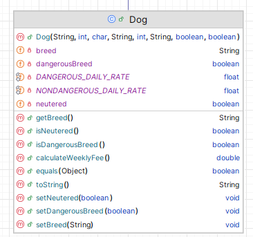

# Dog class

The responsibility for this *concrete* class is to extend Pet and implement the class for a Dog.  The UML is here:

NOTES: 

- You may add additional instance fields of your choice (for extra credit!).  If you do so, the method list and parameters for existing methods will change/grow.  
- The **Hierarchy Overview** tab has generic information on coding constructors, getters, setters and toString.  The information below is just the specifics related to this class.

---

## Fields

There are 3 extra private fields in this class:

|      Property                |         Sample Value          |        Default Value   |        Description  |
|------------------------------|------------------------|------------------------|------------------------|
| breed          | Golden Retriever              | (20 chars)                   | max 20 chars|
| dangerousBreed          | true             | false             |  true if dog is a dangerous breed|
| neutered          | true            | false                 | true if dog is neutered|

There are 2 extra constants :

|      Property                |         type          |         Value   |        Description  |
|------------------------------|------------------------|------------------------|------------------------|
| DANGEROUS_DAILY_RATE          | float              | 40                   | cost to house if dangerous|
| NONDANGEROUS_DAILY_RATE          | float             | 30             |  cost to house if not dangerous|

## Constructor

There is one constructor for this class. The parameter list for this constructor should be the same as the parameter list for the Pet class but with the additional field above .  The constructor should call the superclass constructor and also instantiate the field.

~~~

public Dog(String name, int age, char sex, String owner, int id, String breed, boolean dangerousBreed, boolean neutered) {
   
~~~

## Abstract methods

`calculateWeeklyFee` - this method returns a double.
~~~
        // gets dailay rate for dog depending on whether dangerous or not
        //muliplie rate by number of days in kennel and returns answer
        
~~~

## toString method

This method should build a one line string containing the following information and return it (note: no \n should be included in the String):

- details from the Pet toString() as well as fields above.

