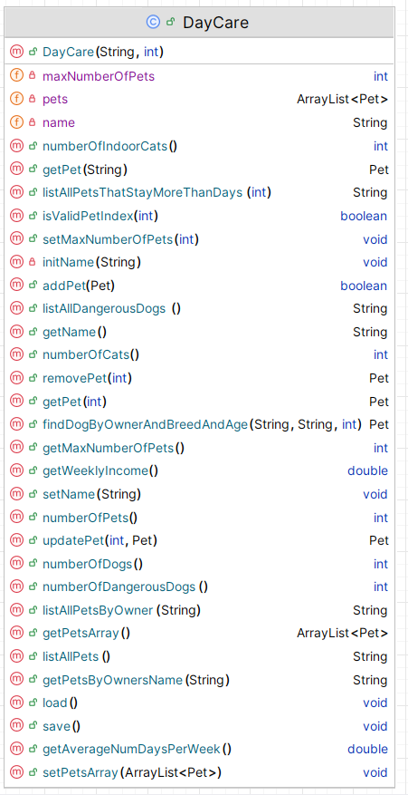

# DayCare class 

This API class is responsible for storing and managing ALL the Pets in the system. 

This UML here is starter UML - depending on the menu items you include in your Driver class, the methods here will grow / change:

There is starter code for DayCare in the Starter Code you are given.

---

## Fields

There are three private fields, 
 - *pets*, which is an ArrayList of *Pet*;
 - *maxNumberOfPets* , the max number of pets the kennels has space for, can change over time
 - *name* , kennel name max 20 chars

---

## Basic CRUD on Pets ArrayList

### addPet (with the new Pet as a parameter)
This method will add a Pet object (passed as a parameter) to the ArrayList *pets*.  There is no validation in this method.  Returns true if the Pet was added and false if not.

### deletePetByIndex (with index - position of Pet in array list as parameter)
  This method removes an Pet object at the location *index*, which is passed as a parameter.  There is some validation in this method.  
  - Check that the passed index exists in the ArrayList:
      - if it does exist, remove it from the ArrayList and return *the object that was just deleted*.
      - if the passed index is not valid, return *null*.

### deletePetById (with id of Pet as parameter)
  This method removes an Pet object with the id which is passed as a parameter.  There is some validation in this method.  
  - Check that the passed id exists in the ArrayList:
      - if it does exist, remove the corresponding Pet from the ArrayList and return *the object that was just deleted*.
      - if the passed index is not valid, return *null*.

### getPetByIndex(with index - position of Pet in array list as parameter)
 This method returns an Pet object at the location *index*, which is passed as a parameter.  There is some validation in this method.  
  - Check that the passed index exists in the ArrayList:
      - if it does exist, return *the object at that position*.
      - if the passed index is not valid, return *null*.

### getPetById(with id of Pet as parameter)
 This method returns a Pet object with that exact *id* (ignoring case), which is passed as a parameter.  There is some validation in this method.  
  - Check that the passed *id* exists in the ArrayList:
      - if it does exist, return *the object with that id*.
      - if the passed id is not found, return *null*.

---

## Reporting Methods

### listAllPets()
This method should return a String containing the details of all the pets in **pets** along with the index number associated with each Pet object.  If no pets exist yet, **"No Pets"** should be returned.

### listAllCats()
This method should return a String containing the details of all the cats in **pets** along with the index number associated with each Cat object.  If no cats exist yet, **"No cats"** should be returned.

### listAllDogs()
This method should return a String containing the details of all the dogs in **pets** along with the index number associated with each Dog object.  If no dogs exist yet, **"No Dogs"** should be returned.

### listAllDangerousDogs()
This method should return a String containing the details of all the dangerous dogs in **pets** along with the index number associated with each Dog object.  If no dogs exist yet, **"No Dogs"** should be returned.
 
- If no dangerous dogs exist, **"No Dangerous Dogs in the Kennels"** should be returned.

### listAllPetsByOwner(String owner as a parameter)
This method should return the list of pets associated with that owner.
 

- If no such Pet exist, **"No Pet with owner ??"** (include owner name) should be returned..

### listAllPetsThatStayMoreThanDays(numDays as a parameter)
This method should return the list of pets with that stay more than the input days.
 

- If no such Pet exist, **"No Pet stays longer than ??"** (include num days) should be returned..

### numberOfPets()
This method returns the number of Pet objects in the system (in **pets**).

### numberOfCat()
This method returns the number of Cat objects  in the system (in **pets**).

### numberOfDogs()
This method returns the number of Dog objects in the system (in **pets**).

### numberOfDangerousDogs()
This method returns the number of dangerous Dogs in the system (in **pets**).

### numberOfIndoorCats()
This method returns the number of indoor cats in the system (in **pets**).

---

## Update Methods

### updateDog(int id, Dog updatedDetails)
This method takes in a id and replaces the corresponding  object with the Dog object as input (updatedDetails).

### updateCat(int id, Cat updatedDetails) 
This method takes in a id and replaces the corresponding  object with the Cat object as input (updatedDetails).

## Validation Methods

### isValidId(int id)
This method is written for you.  It returns:
  - **true** if that id does not exist in the **pets** collection
  - **false** if that id does  exist in the **pets** collection

---

## Other Methods
### getWeeklyIncome()
 - returns a weekly income from all pets in the kennels
 - 
### getAverageNumDaysPerWeek()
 - returns a average number of days that pets stay in the kennels
 
### findDogByOwnerAndBreedAndAge(String name, String breed, int age)
 - returns the pet that matches the parameters passed in, 
 - returns null if there is no match

### getPetsByOwnersName(String name)
 - returns a String with all the pets for a particular owner name
 - returns **"No Pets for ??"** if there are no pets for that owner
  
---

## Persistence

### save
This method saves all Pet objects from the ArrayList  to an XML file *Pets.xml*.  

### load
This method loads all saved Pet objects back into the program (i.e into the ArrayList pets) from the XML file *Pets.xml*.  

---

