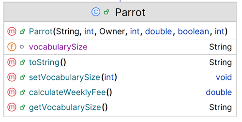

# Parrot class

The responsibility for this *concrete* class is to extend Bird and implement the class for a CParrotat.  The UML is here:

NOTES: 

- You may add additional instance fields of your choice (for extra credit!).  If you do so, the method list and parameters for existing methods will change/grow.  
- The **Hierarchy Overview** tab has generic information on coding constructors, getters, setters and toString.  The information below is just the specifics related to this class.

---

## Fields

There is 1 extra private field in this class:
 private String vocabularySize

|      Property                |         Sample Value          |        Default Value   |        Description  |
|------------------------------|------------------------|------------------------|------------------------|
| vocabularySize          | Basic              | Amazing                   | number of words is changed to a String using the utility class|

## Constructor

There is one constructor for this class. The parameter list for this constructor should be the same as the parameter list for the Bird class but with the additional fields above .  The constructor should call the superclass constructor and also instantiate the field.

~~~
public Parrot(String name, int age, Owner owner, int id, double wingSpan, boolean canFly, int vocabularySize) {
   
             
      
~~~

## Abstract method

`calculateWeeklyFee` - this method returns a double 
~~~
        // base rate is 10 per day, 
     
~~~

## toString method

This method should build a one line string containing the following information and return it (note: no \n should be included in the String):

- details from the Bird toString() as well as the fields of this class

