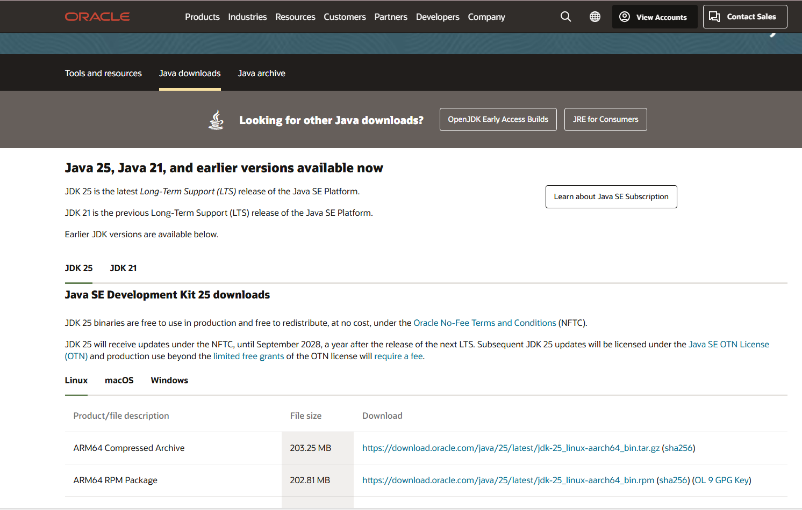
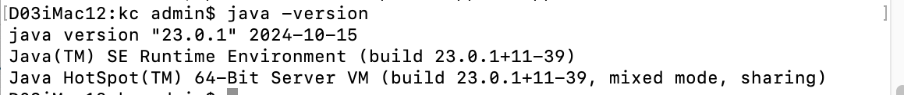

# Install Java JDK: Windows

Visit this page:

- <https://www.oracle.com/java/technologies/javase-downloads.html>

This year we are using **JDK ver 25** 

NOTE:  Remember you are using version 25.

On windows, your download is likely to be for Windows 64:

- jdk-25_windows-x64_bin.exe

To check if it is installed ok - you should try

~~~
java -version
~~~

You should get something like this:

You may want to remove a version. The installed versions can be inspected via windows Settings:

Select `Apps` above to see something like:

There are multiple version of java installed here. Clicking on any one will allow you to uninstall:

# Install Java JDK: Mac

For the mac, the best way to install is to use Brew. These commands should do:

~~~
brew update
brew install jenv
brew cask install caskroom/versions/java23
~~~

