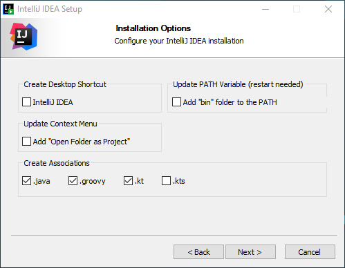

# : Install IntelliJ Idea

To date we have been using Processing as our editor. 

Now, we will move to a professional Java Integrated Development Environment (IDE) called IntelliJ Idea.

Before downloading, first apply for a new `Jetbrains` student account using this link:

- <https://www.jetbrains.com/community/education/#students>

Make sure to ___use your WIT email address___, as this will allow you to gain access to the professional versions of all Jetbrains products.

Now proceed to download and install the `Ultimate` version of the Idea IDE:

- <https://www.jetbrains.com/idea>

During installation, make sure the following options are selected during the install:

## Launching IntelliJ

Now that IntelliJ is installed, launch it. 

You may be asked to import settings...choose *Do not import settings*.

A welcome screen should now appear:

From here, you can work with projects, choose to customise the look-and-feel of IntelliJ and learn more about the IntelliJ IDEA.  

## Licence

From the above splash screen, click on the `gear` icon in the bottom left hand corner.  Then select the option to manage licenses.  

If you have already received an email reply from Jetbrains and have set up your JB Account, click on `Add New Licence` to license your new installation:

Entering your credentials should fully activate the application.

You can now move onto the next lab, where you will verify the IntelliJ installation.

