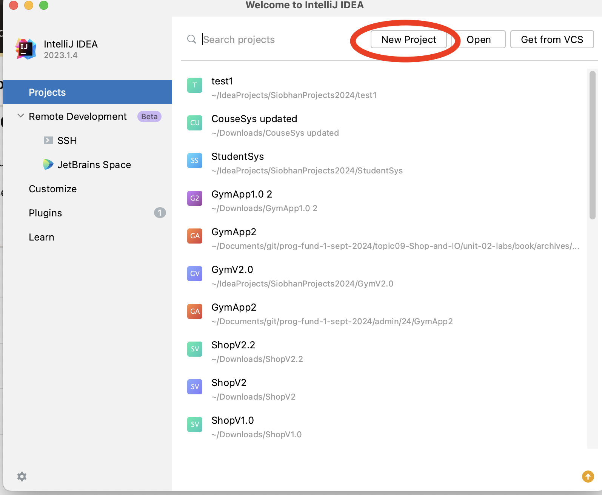
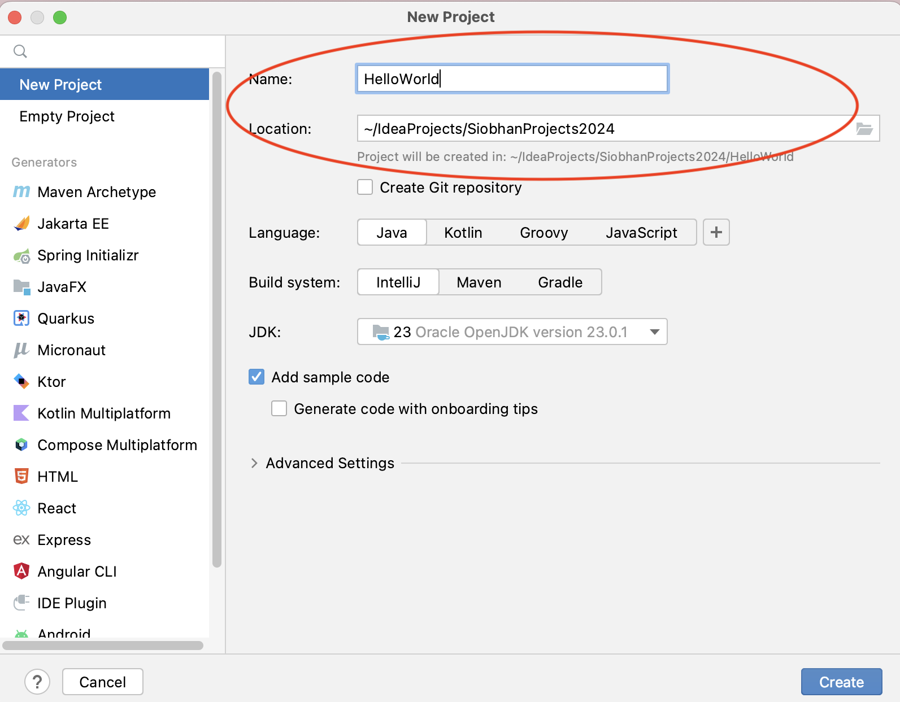
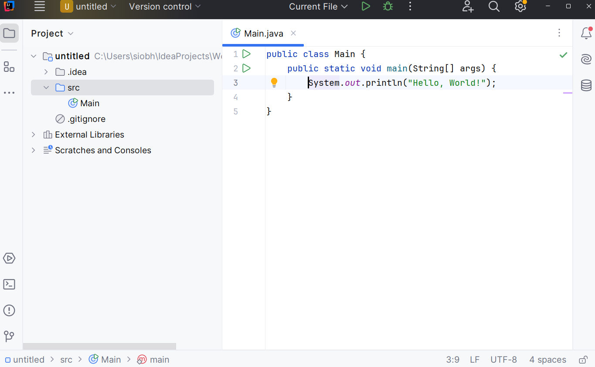
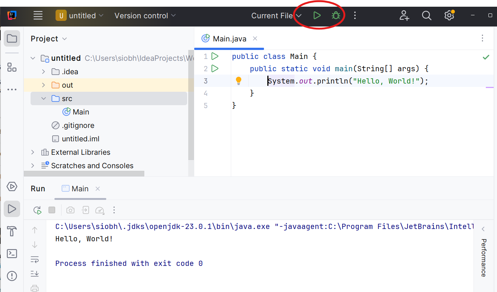

# Hello World

To create a project - select Create New Project

Hello

This will allow you to name the and locate the project:

Call the project `Hello` - and make sure you know where it is located. You may be asked to create the folder:

The project should look like this eventually:

Pressing the green Run button on the top right - and the program should execute:

