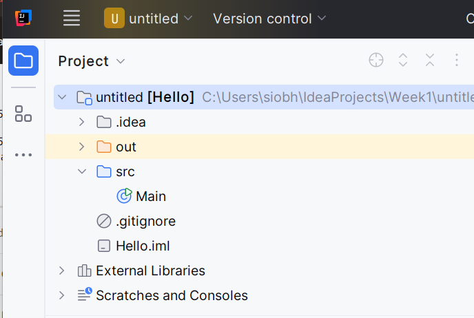
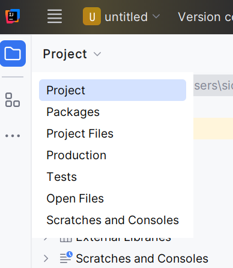

# Exploring the Project View

In IntelliJ, take a close look at the project window:

Try to expand the view so that it looks like this:

The `Main` icon above is a representation of the file in editor window on the right.

Now select the `Project` dropdown - to reveal potential alternative views for this window:

From this - select `Packages`. This presents a simpler view:

You could regard these two views as:

- Physical: the actual files in the project, included all generated and system files. This view more or less corresponds to the Explorer/Finder view
- Logical: just the files that are significant to the programmer. This hides all non-editable files, and allows you to focus on just the project sources.

In general, you will be happy to work with the Packages (logical) view. As you gain more experience, and the projects become more sophisticated, you may occasionally need to view the Project (physical) view.