# 7. Debug

In this step, you will copy the debugging steps that are laid out in the debug reference material associated with this lab.  For convenience, they are displayed here too.   

Download, extract and open [this code](archives/code-from-debug-lecture.zip) in IntelliJ.

## Debugging the example from the reference material

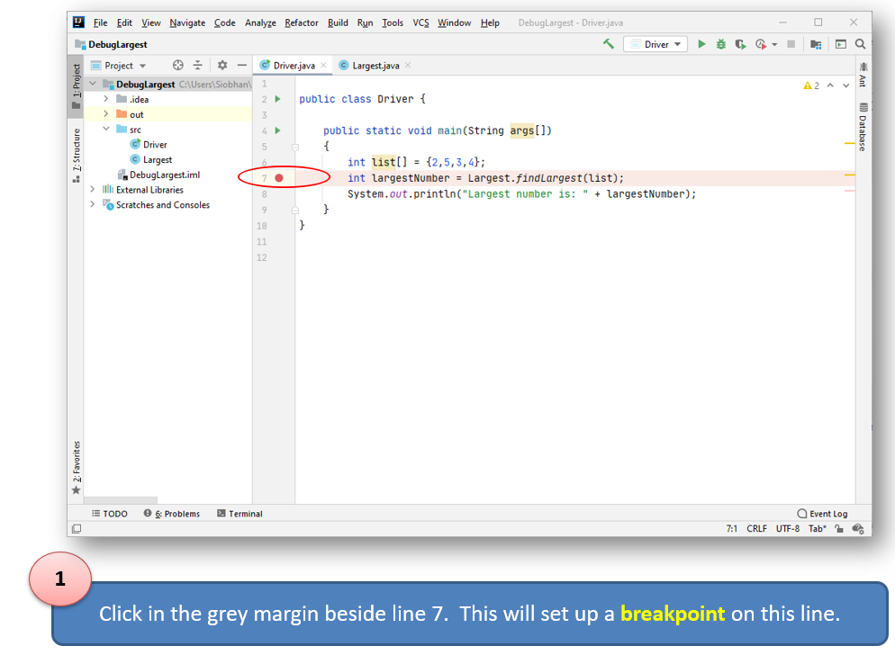

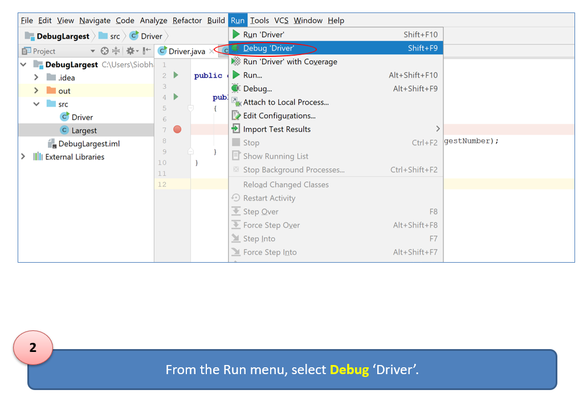

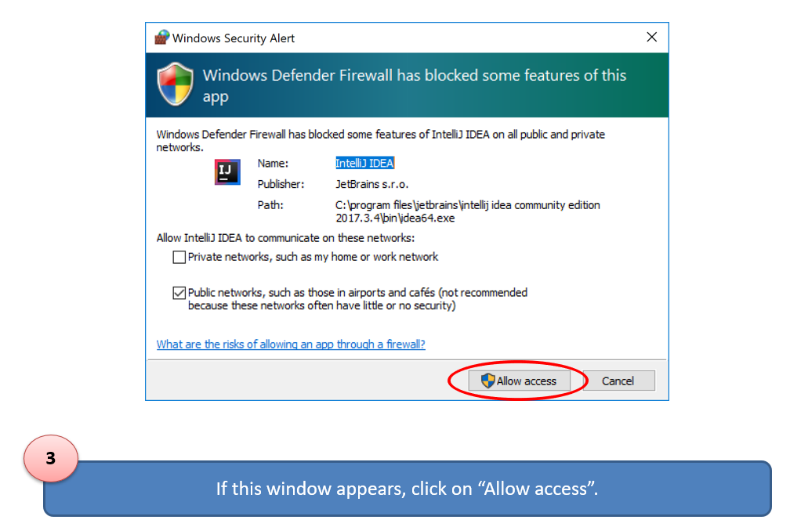

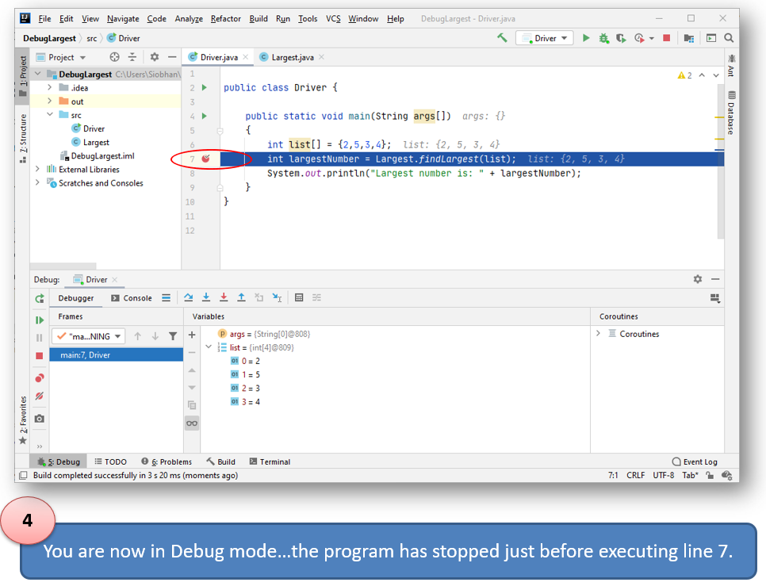

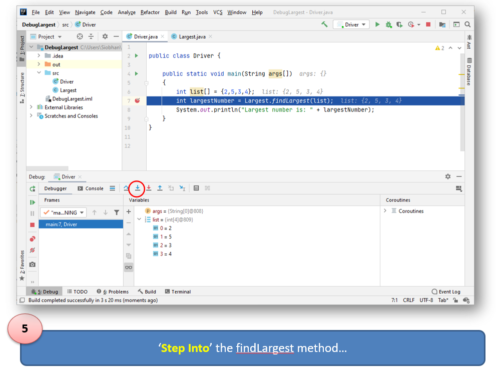

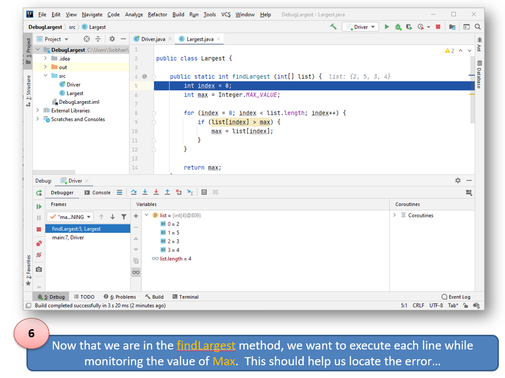

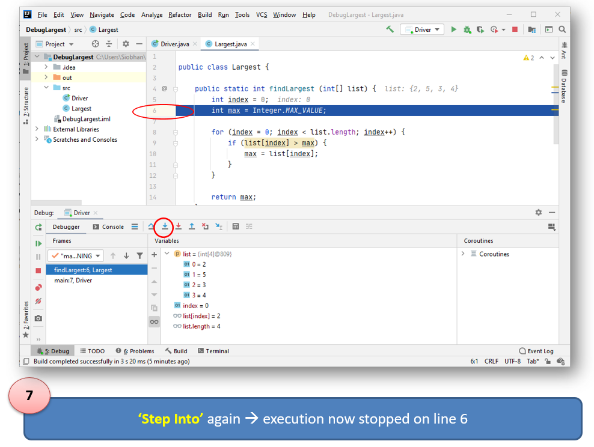

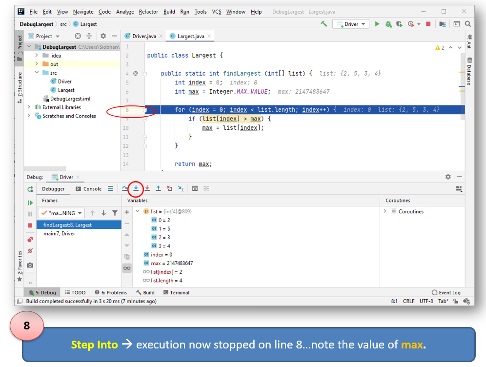

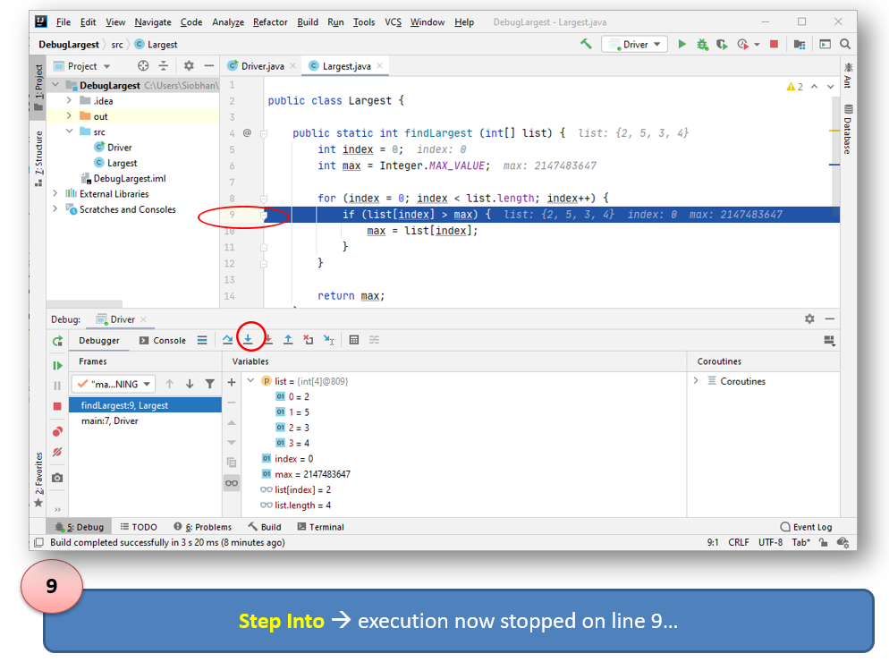

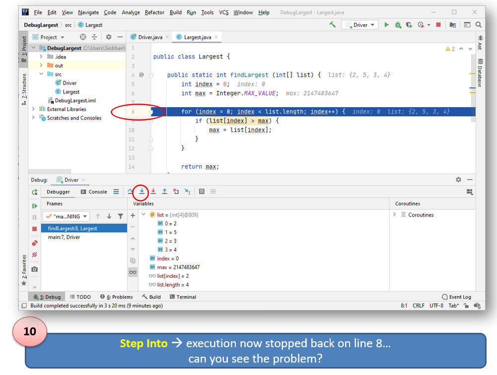

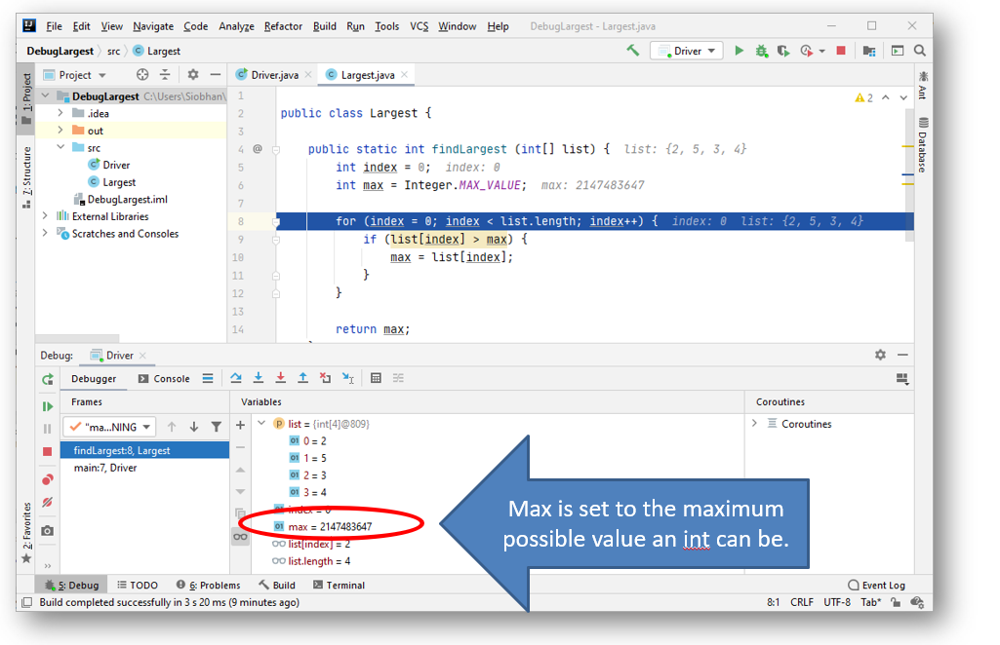

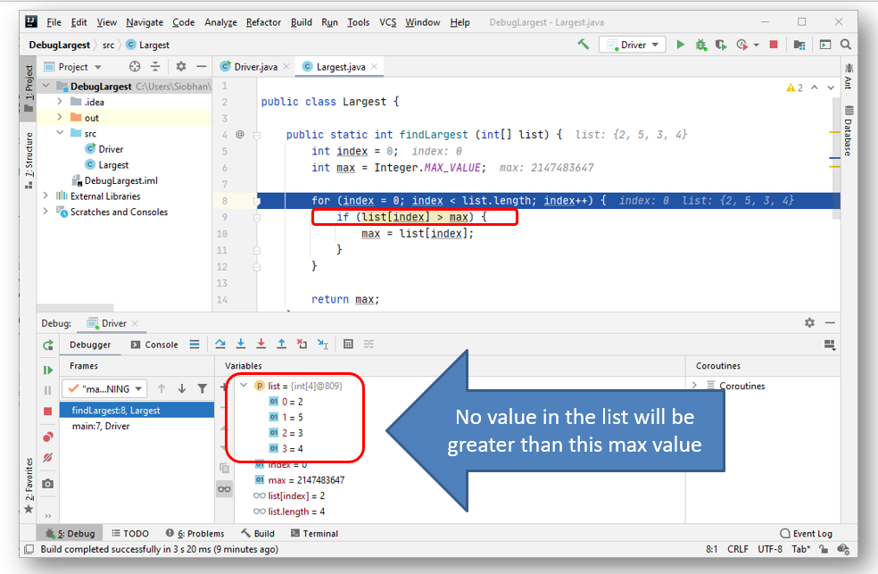

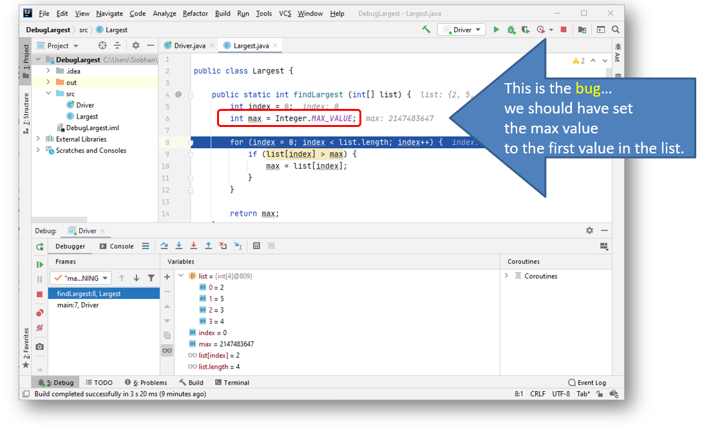

