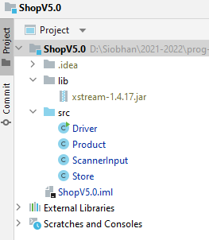
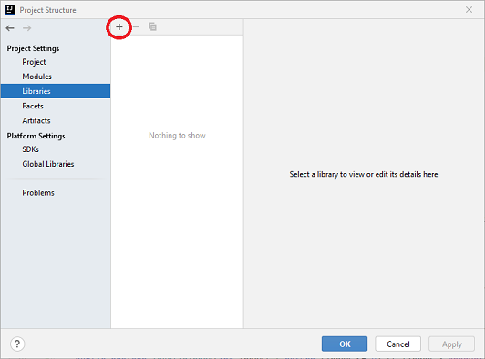

# 2. Developing Shop V5.0 

In IntelliJ, create a new project called ShopV5.0 and copy these files into it:

- [Driver.java](archives/Driver.java)

- [Store.java](archives/Store.java)

- [Product.java](archives/Product.java)

- [ScannerInput.java](archives/ScannerInput.java)

We will add persistence to our app via two new items to the menu, one for Save and one for Load.  We will use an external component called XStream for our serialisation to XML.

## Setting up the Component for Serializing

Download the XStream, version 1.4.20 `jar` file from this website:

- <https://mvnrepository.com/artifact/com.thoughtworks.xstream/xstream/1.4.20>

In IntelliJ, right click on the ShopV5.0 project folder and select **New**, followed by **Directory**.  Call the new directory **lib**.  Drag the xstream jar file already downloaded into the lib folder.

Your workspace should look like this:

From **File** menu, select **Project Structure**.  Click on **Libraries**.  To add a library to your build path, click on the + : 

Select Java and locate the XStream compenent in your lib folder…click OK (a few times!).

## Updating Store Class to serialize and deserialize products 

Now that we have brought the XStream component into our project and added it to the build path (so the compiler finds it), we can now start using it.

In the Store class, create these two new methods that will use the XStream component to serialise to and from products.xml which is located in the root directory of your project:

~~~

    @SuppressWarnings("unchecked")
    public void load() throws Exception {
        //list of classes that you wish to include in the serialisation, separated by a comma
        Class<?>[] classes = new Class[] { Product.class };

        //setting up the xstream object with default security and the above classes
        XStream xstream = new XStream(new DomDriver());
        XStream.setupDefaultSecurity(xstream);
        xstream.allowTypes(classes);

        //doing the actual serialisation to an XML file
        ObjectInputStream is = xstream.createObjectInputStream(new FileReader("products.xml"));
        products = (ArrayList<Product>) is.readObject();
        is.close();
    }

    public void save() throws Exception {
        XStream xstream = new XStream(new DomDriver());
        ObjectOutputStream out = xstream.createObjectOutputStream(new FileWriter("products.xml"));
        out.writeObject(products);
        out.close();
    }

~~~

If the code doesn't compile, you may need to import these packages: 

~~~
import com.thoughtworks.xstream.XStream;
import com.thoughtworks.xstream.io.xml.DomDriver;

import java.io.FileReader;
import java.io.FileWriter;
import java.io.ObjectInputStream;
import java.io.ObjectOutputStream;
~~~

## Adding load and save functionality to the menu

In the Driver class, add options 9 and 10 to the menu.  Note that we have added some nice formatting to the menu as visually it is getting quite large:

~~~
    private int mainMenu() {
        return ScannerInput.readNextInt("""
                ------------------------------------------------------------------
                |                            Shop Menu                           |
                ------------------------------------------------------------------
                |   1) Add a product                                             |
                |   2) List the Products                                         |
                |   3) Update a product                                          | 
                |   4) Delete a product                                          | 
                ------------------------------------------------------------------
                |   5) List the current products                                 |
                |   6) Display average product unit cost                         |
                |   7) Display cheapest product                                  |
                |   8) List products that are more expensive than a given price  |
                ------------------------------------------------------------------
                |   9)  Save products to products.xml                            |  
                |   10) Load products from products.xml                          |  
                |   0)  Exit                                                     |  
                ------------------------------------------------------------------
                ==>>  """);
    }
~~~

In the Driver class, update the switch statement to call two new methods for save and load: 

~~~
            switch (option) {
                case 1 -> addProduct();
                case 2 -> printProducts();
                case 3 -> updateProduct();
                case 4 -> deleteProduct();
                case 5 -> printCurrentProducts();
                case 6 -> printAverageProductPrice();
                case 7 -> printCheapestProduct();
                case 8 -> printProductsAboveAPrice();
                case 9 -> saveProducts();
                case 10 -> loadProducts();
                default -> System.out.println("Invalid option entered: " + option);
            }
~~~

and the code for saveProducts() is here:

~~~
    private void saveProducts() {
        try {
            store.save();
        } catch (Exception e) {
            System.err.println("Error writing to file: " + e);
        }
    }
~~~

and the code for loadProducts() is here:

~~~
    private void loadProducts() {
        try {
            store.load();
        } catch (Exception e) {
            System.err.println("Error reading from file: " + e);
        }
~~~

## Testing the load and store

You should be in a position now to test.  

Start your app and create two products e.g.

~~~
Please enter the product description: 24 inch monitor
Please enter the product code: 3423
Please enter the product cost: 129.99
Is this product in your current line (y/n): y

Please enter the product description: 14 inch monitor
Please enter the product code: 2322
Please enter the product cost: 109.99
Is this product in your current line (y/n): y
~~~

Now try menu option 9 to save your products. 

You should now see a products.xml file appearing in the root folder of your project in IntelliJ.  

Open this file and it should contain something similar to this:

~~~xml
<object-stream>
  <list>
    <Product>
      <productName>24 inch monitor</productName>
      <productCode>3423</productCode>
      <unitCost>129.99</unitCost>
      <inCurrentProductLine>true</inCurrentProductLine>
    </Product>
    <Product>
      <productName>14 inch monitor</productName>
      <productCode>2322</productCode>
      <unitCost>109.99</unitCost>
      <inCurrentProductLine>true</inCurrentProductLine>
    </Product>
  </list>
</object-stream>
~~~

Exit your application (menu option 0) and run it again.

Test option 10 and make sure that the saved products are loaded back into your products ArrayList correctly.

