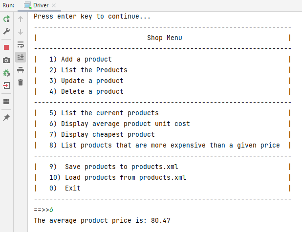

# 3. Shop V5.0 - Utilities

In this step, you will continue working on Shop V5.0.  

## ScannerInput

We are currently using the `ScannerInput` class to manage our user I/O.  If you recall, we created this class to get past the bug that was in Scanner i.e. a read line is ignored after reading an int, float, double.  In our ScannerInput class, we are using the try-catch construct to continually ask the user for correct input when asking for an int and a double.  

Open this class now and familiarise youself with the code.

This type of class is called a **Utility**.  Did you notice that we cut and paste the code into our SocialNetwork project too?  We can reuse this utility class in any of our console projects.  

## Other Utilities

We can write and reuse other types of utilities too.  It is a really good idea to build a repository of these utilities for project work.

For example, did you notice that the average product price typically has a lot more than two digits after the decimal point.  Run your application and having entered a few new products, try option 6 to display the average price.  There are a lot more than two decimal places.  

We want to truncate this output to two decimal places.  Let's start by creating a new class called `Utilities` in your `src` folder. 

In this class, write this utility method that will truncate (not round) the amount to two decimal places:

~~~
public class Utilities {
    
    public static double toTwoDecimalPlaces(double number){
        return (int) (number * 100 ) / 100.0;
    }
    
}
~~~

Remember your order of evaluation...brackets are done first, then division.  Try to figure out what's happening in this method.

Now we will return to our Store class and the averageProductPrice method which is currently coded like this:

~~~
    public double averageProductPrice() {
        if (!products.isEmpty()) {
            double totalPrice = 0;
            for (Product product : products) {
                totalPrice += product.getUnitCost();
            }
            return totalPrice / products.size();
        } else {
            return -1;
        }
    }
~~~

Before returning the result of the calculation, we want to truncate it to two decimal places using our new utility method, as shown here:

~~~
    public double averageProductPrice() {
        if (!products.isEmpty()) {
            double totalPrice = 0;
            for (Product product : products) {
                totalPrice += product.getUnitCost();
            }
            return Utilities.toTwoDecimalPlaces(totalPrice / products.size());
        } else {
            return -1;
        }
    }
~~~

When you have the changes made, test the code to make sure the truncating is working when calculating the average price.

## Another Utility method

Let's add another method to the Utility class.  

In our Driver, we have the following code repeated in both the update and the add:

~~~
        //Ask the user to type in either a Y or an N.  This is then
        //converted to either a True or a False (i.e. a boolean value).
        char currentProduct = ScannerInput.readNextChar("Is this product in your current line (y/n): ");
        boolean inCurrentProductLine = false;
        if ((currentProduct == 'y') || (currentProduct == 'Y'))
            inCurrentProductLine = true;
~~~

We are going to write a utility method that will convert a `Y` or a `y` response to `true` and if any other character is entered, a `false` will be returned. 

In your Utilities class, add the following method:

~~~
    public static boolean YNtoBoolean(char charToConvert){
        return ((charToConvert == 'y') || (charToConvert == 'Y'));
    }
~~~

Now return to your Driver class and in the addProduct method, use your new utility method:

~~~
    //gather the product data from the user and create a new product object - add it to the collection.
    private void addProduct(){

        String productName = ScannerInput.readNextLine("Enter the Product Name:  ");
        int productCode = ScannerInput.readNextInt("Enter the Product Code:  ");
        double unitCost = ScannerInput.readNextDouble("Enter the Unit Cost:  ");

        //Ask the user to type in either a Y or an N.  This is then
        //converted to either a True or a False (i.e. a boolean value).
        char currentProduct = ScannerInput.readNextChar("Is this product in your current line (y/n): ");
        boolean inCurrentProductLine = Utilities.YNtoBoolean(currentProduct);

        boolean isAdded = store.add(new Product(productName, productCode, unitCost, inCurrentProductLine));
        if (isAdded){
            System.out.println("Product Added Successfully");
        }
        else{
            System.out.println("No Product Added");
        }
    }

~~~

and also use it in the updateProduct method too (code snippet):

~~~
...

    //Ask the user to type in either a Y or an N.  This is then
    //converted to either a True or a False (i.e. a boolean value).
    char currentProduct = ScannerInput.readNextChar("Is this product in your current line (y/n): ");
    boolean inCurrentProductLine = Utilities.YNtoBoolean(currentProduct);

    //pass the index of the product and the new product details to Store for updating and check for success.
    if (store.updateProduct(indexToUpdate, new Product(productName, productCode, unitCost, inCurrentProductLine))){
        System.out.println("Update Successful");
    }

...
~~~

Now run your app again and test that both the add and update work as expected for the Y and N options. 

