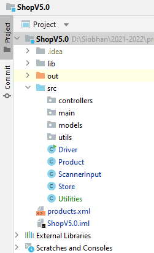
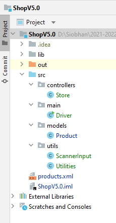
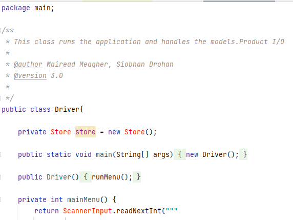

# 4. Shop V5.0 - Packages

In this step, you will continue working on Shop V5.0 but we will start adding `packages` to our folder structure.  This will help us manage our projects as they grow larger by categorising code into different areas. 

## Adding a package

Right click on your src folder and select **New, Package**.  Give the package the name **controllers**.

Repeat the same process to add three more packages, one called **utils**, one called **models** and the last called **main**.

Your folder structure should look something like this:

Now move the java code into the respective packages so you have the below structure.  You will be prompted to **refactor** - yes, you do want to do this.  Your folders should look like this now:

During the refactoring, code changes will have happened in your project.  Review your code now and see can you spot some of them e.g.

Store.java:
~~~
package controllers;

import models.Product;
import utils.Utilities;
~~~

Driver.java:
~~~
package main;

import controllers.Store;
import models.Product;
import utils.ScannerInput;
import utils.Utilities;

~~~

If there are new syntax errors in your code, it's probably to do with import issues e.g.:

If this happens to you, click on the errored code (e.g. Store) and press the key combination ALT+Enter.  The import should automatically be included at the top of your class OR you will see a context sensitive menu appearing offering options for fixing the error with "import class" as the first option.

Should you encounter errors in this step, the solution for V5.0 is available in the solutions tab.

