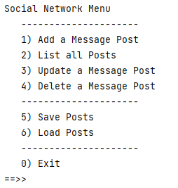
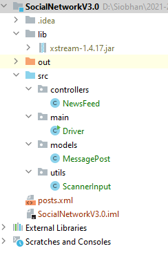

# 6. Social Network V3.0

Create a new project, SocialNetworkV3.0 and copy in the code from [SocialNetworkV2.0](archives/SocialNetworkV2.0.zip).

Using what you have learned in this lab so far, make the following changes to SocialNetworkV3.0 app.

## Add Persistence

Add menu options to perform XML persistence, load and save, using the XStream Component(<https://mvnrepository.com/artifact/com.thoughtworks.xstream/xstream/1.4.17>)

## Package Structure

Use a package structure similar to that of ShopV5.0.  Your folder structure should look something like this:

Remember you can use IntelliJ's ALT+Enter to do the importing of any unresolved classes. 

## Utilities

Currently, we have no validation on our MessagePost fields: author, message and likes.  

Let's add some validation to the **author** field...maybe we are going to restrict it to max 10 characters. 

We could just put the validation directly in our constructor and setter like we did last semester...OR we could adopt a new approach where we create new Utility methods that will do the validaion for us.  By taking the approach of new Utilities methods, it will mean that we can reuse this validation in other projects we work on...we can just copy the Utilities class into the new project.

#### Utilities Class

First create a new class called `Utilities` in the `utils` package and to it, add the following code:

~~~
package utils;

public class Utilities {

    public static String truncateString(String stringToTruncate, int length){
        if (stringToTruncate.length() <= length) {
            return stringToTruncate;
        }
        else{
            return stringToTruncate.substring(0, length);
        }
    }

}
~~~

This new method, `truncateString` returns a String that was passed as a parameter, truncated to a specific length, also passed as a parameter.  If the original String is less than the passed length, then the original String is just returned.

We have made this method universal, in that we can choose to truncate a String to any length. 

Now add another utility method to your Utilities class:

~~~
public static boolean validateStringLength(String strToCheck, int maxLength){
        return strToCheck.length() <= maxLength;
    }
~~~

This method takes in a string, passed as a parameter and valdiates whether it is less than or equal to a specific length or not.

#### MessagePost class

Now let's use these new methods in our MessagePost class.  

In the `MessagePost` constructor, make the following code changes:

~~~
    public MessagePost(String author, String message) {
        this.author = Utilities.truncateString(author, 10);
        this.message = message;
    }
~~~

Note that, before we update this.author, we are using our new method `truncateString` to ensure the author field is max 10 characters.  

Then in the `setAuthor` method, make the following code changes, so that we will ONLY update if we are given a new author of 10 chars or less:

~~~
    public void setAuthor(String author) {
        if (Utilities.validateStringLength(author, 10)) {
            this.author = author;
        }
    }
~~~

Now test the changes...

- for a new message post, is your author field truncated correctly?  Test at the **boundaries** i.e. adding a new message with an author of 9 chars, one of 10 chars and another of 11 chars.  A huge amount of bugs reside in boundaries!

- now try update any of the message posts you added...are you noticing a bug here?  If we update the author, regardless of whether we use 9, 10, 11 chars, the author is always updated.  BUT, we don't want to update the author if we enter more than 10 chars...we want it ignored and the previous value left as is.  

#### Debugger

Set some breakpoints in your code and see can you figure out, using the debugger, where the bug is.  

#### Fixing the bug

The bug is lying in the `updateMessagePost` method in the NewsFeed class.  

~~~
    public boolean updateMessagePost(int indexToUpdate, MessagePost updateDetails) {
        //find the object by the index number
        MessagePost foundMessage = findMessagePost(indexToUpdate);

        //if the object exists, use the details passed in the updateDetails parameter to
        //update the found object in the ArrayList.
        if (foundMessage != null) {
            foundMessage.setAuthor(updateDetails.getAuthor());
            foundMessage.setMessage(updateDetails.getMessage());
            return true;
        }

        //if the object was not found, return false, indicating that the update was not successful
        return false;
    }
~~~
 
We are passing in the updated details from the Driver console via a new MessagePost object called `updateDetails`.  The reason we are having the bug, is the constructor is invoked in the Driver class to build this `updateDetails` object.  This means that the information entered by the user is being truncated regardless because we are calling the constructor to build this object.  This is our bug!  We only want existing details for an author to be updated IF and ONLY IF the new author is 10 characters or less. Clearly passing the details in an object of MessagePost is not going to work for us. Instead, we can pass the fields individually.

To fix this bug, we will update the 'updateMessagePost' in the NewsFeed class to be:

~~~
    public boolean updateMessagePost(int indexToUpdate, String author, String message) {
        //find the object by the index number
        MessagePost foundMessage = findMessagePost(indexToUpdate);

        //if the object exists, use the details passed in the parameters to
        //update the found object in the ArrayList.
        if (foundMessage != null) {
            foundMessage.setAuthor(author);
            foundMessage.setMessage(message);
            return true;
        }

        //if the object was not found, return false, indicating that the update was not successful
        return false;
    }
~~~

This will cause an issue in the Driver, in the 'updateMessagePost' method.  Change this line of code from:

~~~
    if (newsFeed.updateMessagePost(indexToUpdate, new MessagePost(author, message))){
~~~

to 

~~~
     if (newsFeed.updateMessagePost(indexToUpdate, author, message)){

~~~ 

Now test the code again for author where you are entering values of 9, 10, 11 chars.  The bug should be resolved.

## Message - More Validation

Now try to use the same utility method approach to ensure the `message` is max 40 chars for a new message...and an existing message is ONLY updated if the new message is less than or equal to 40 chars. 

Again test the code at the boundaries.  And test both when add a product and updating a product.

