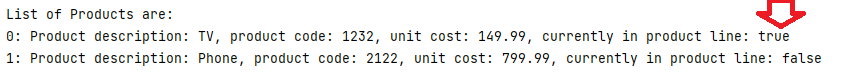

# 7. ShopV5.0 - more utilities

For this step, should you need it, the solution to:

- ShopV5.0 before exercises [is here](archives/ShopV5.0-before-exercises.zip).

- SocialNetworkV3.0 [is here](archives/SocialNetworkV3.0.zip).

## Utilities - truncateString and validateStringLength

We are now going to add the utility methods that we used in the previous step to our Shop project. 

Copy this code into your ShopV5.0 Utilities class:

~~~
    public static String truncateString(String stringToTruncate, int length){
        if (stringToTruncate.length() <= length) {
            return stringToTruncate;
        }
        else{
            return stringToTruncate.substring(0, length);
        }
    }

    public static boolean validateStringLength(String strToCheck, int maxLength){
        return strToCheck.length() <= maxLength;
    }
~~~

And use it to validate the product name to maximum 20 characters.  Test again at the boundaries i.e. enter a product name of 19 chars, then one of 20 chars and finally one of 21 chars. Make sure you test these scenarios:

- Add a new product - the product name should be automatically truncated to 20.

- Update an existing product - ONLY if the product name entered is less than or equal to 20, should the update of product name occur. If the product name is 21 or more chars, it should be ignored and the existing value retained.

## Utilities - validRange

Now try to write a new method called `boolean validRange(int numberToCheck, int min, int max)`.  The Javadoc for this method is:

~~~
 /**
     * This method returns true if the numberToCheck is between min and max (both inclusive)
     *
     * @param numberToCheck The number whose range is being checked.
     * @param min The minimum range number to check against (inclusive)
     * @param max The maximum range number to check against (inclusive)
     * @return Returns true if the numberToCheck is between min and max (both inclusive), false otherwise.
     */
~~~

When you have this method written, use it to validate the productCode...the value must be between 1000 and 9999 inclusive.  If, when adding a new product, the value is outside of this range, a default value of -1 should be used.  When updating an existing product, no default value should be set if the new value is out of the range; it should remain as is. 

## Utilities - booleanToYN

Did you notice, when listing your products, that the boolean value of either true or false is printed out to the user:

This is not very user friendly; a Y or an N would be nicer. 

Let's add a new Utilities method that returns Y if the booleanToConvert value is true and returns N otherwise.

~~~
    public static char booleanToYN(boolean booleanToConvert){
        return booleanToConvert ? 'Y' : 'N';
    }
~~~

Now use this method in your toString method in the Product class to ensure the user sees Y or N instead of true or false.  Test by adding a few new products and displaying them.

