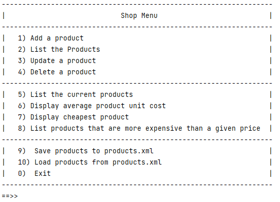
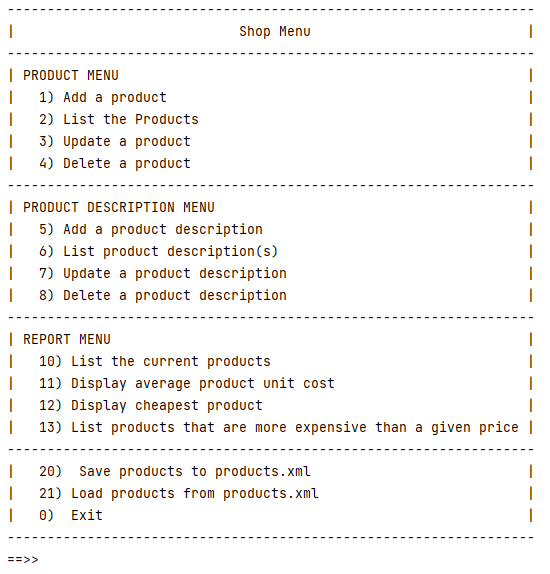

# Challenge (ShopV7.0 - Product)

Note: The remaining steps in this lab are a challege; i.e. they are designed to push your knowledge of the area.  Don't panic if you aren't fully sure how to code them, however, we would suggest that you download the solutions so that you can see how it is coded.  

Using the files from [solution to ShopV6.0](archives/ShopV6.0.zip), create a new project called ShopV7.0.

Run your new ShopV7.0 and verify that you have the following menu displayed:

 

We are now going to update the Shop App so that we can add multiple descriptions for each product, each in a different language. i.e. our menu will look like:

 

Descriptions can only be added for a specific product once that product has been created.  The descriptions can only be maintained via these new menu options, 5-8.  This means that we won't have to update the existing CRUD we have for product; we will only have to handle the four new menu options.

## Product Class Changes

In order to do this, we will update the Product class so it can store a HashMap of productDescriptions.  Each product will now be able to store multiple product descriptions (value), with each description associated with a specific language (key). 

We will then add a series of CRUD methods in Product for handling this new HashMap field.

Add the following new field to product, where the key represents the language and the value represents the product description in that language:

~~~
    private Map<String,String> productDescriptions = new HashMap<>();
~~~

We will be allowing CRUD on this map.  In order to facilite that, we will need to add a series of new methods to Product.  As you are writing these methods below, make sure you understand what is happening in them.  Ask you lecturer if you have any questions.

The first method will be the getter and setter for the new field:

~~~
    public Map<String, String> getProductDescriptions() {
        return productDescriptions;
    }

    public void setProductDescriptions(Map<String, String> productDescriptions) {
        this.productDescriptions = productDescriptions;
    }
~~~

Add a method to see how many product descriptions have been added:

~~~
public int numberOfDescriptions(){
        return productDescriptions.size();
    }
~~~

Add a method to find a description for a specific language:

~~~
    public String findDescription(String language) {
        return productDescriptions.get(language);
    }
~~~

Now add a method to check if a description is already added for a specific language (note that it returns boolean):

~~~
    public boolean isAlreadyAddedLanguage(String language) {
        return (findDescription(language) != null);
    }
~~~

Now try a method to delete a desciption for a specific language:

~~~
    public String deleteDescription(String language) {
        return productDescriptions.remove(language);
    }
~~~

We will also want to list all of our descriptions:

~~~
    public String listDescriptions() {
        if (numberOfDescriptions() > 0){
            String listToReturn = "";
            for(String language : productDescriptions.keySet()){
                listToReturn += language + ": " + productDescriptions.get(language) + ".\n";
            }
            return listToReturn;
        }
        return "No descriptions added yet";
    }
~~~

And be able to update them:

~~~
    public boolean updateDescription(String language, String updatedDescription) {
        //if the language has been added to the map, use the details passed in the
        //updateDescription parameter to update the description.
        if (isAlreadyAddedLanguage(language)) {
            productDescriptions.put(language, updatedDescription);
            return true;
        }

        //if the language was not found, return false, indicating that the update was not successful.
        return false;
    }
~~~

And the most crucial method, the add:

~~~
    public boolean addDescription(String language, String description){
        if (isAlreadyAddedLanguage(language)) {
            return false;
        }
        else{
            if (LanguageUtility.isValidLanguage(language)) {
                productDescriptions.put(language, description);
                return true;
            }
        }
        return false;
    }
~~~

You will now notice that you have a compile error in the add method.  All the other methods should have behaved syntax-wise!

The error is complaining that it cannot find the `LanguageUtility` class!  And that is because we haven't written it yet!
