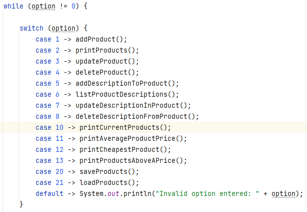

# Challenge (ShopV7.0 - Driver)

Now that we have Product set up to handle our new HashMap field and we have a LanguageUtility handling the HashSet of allowed languages in the app, we are now ready to start working on the Driver.

## Driver

The first thing you need to do is update the menu being printed to the user to this:

 

Then update the switch statement so that the new options are processed like this:

 

We now have syntax errors for cases 5 - 8.

## Case 5 - Add a product description

We will work on each case, one by one.  Comment out the line of code for case 6, 7, 8 in the switch statement.

Now write the code for the `addDescriptionToProduct()`:

- First ask the user to select a product from the list of products available.
- If they selected a valid product:
    - Ask the user to enter a lanauge (make sure it's valid too).
    - Then, ask the user to enter the description for that language.
    - To the selected product, add the language and description
    - Let the user know if the add was succsssful or not. 

Test your code, does it work as expected?  

- Does it allow you to add a description for an invalid lanauage? 
- Does it allow you to add a description for a valid lanauge? 
- What happens if you try to add a second description for a valid lanauge? What did you expect to happen?

## Case 6 - List product description(s)

Now we will work on case 6. Uncomment case 6 in the switch.

Now write the code for the `listProductDescriptions()`:

- First ask the user to select a product from the list of products available.
- Then, if they selected a valid product, list all the descriptions for that selected product.

Test your code, does it work as expected?  

- Does it list all descriptions for a product where descriptions have been added?
- What happens for products where descriptions have not been added?  Does it work as expected?

## Case 7 - Update a product description

Uncomment case 7 in the switch.

Now write the code for the `updateDescriptionInProduct()`:

- First ask the user to select a product from the list of products available.
- Then, if they selected a valid product, list all the descriptions for that selected product.
- If there are descriptions for the selected product, ask the user to enter a valid language
    - If the product already has a description for that language, ask for a new description and update the product with it.
    - Let the user know if the update was succsssful or not. 
- If there are NO descriptions for the selected product, let the user know this too.

Test your code, does it work as expected?  

- Does it allow you to update a description for a language that hasn't been added yet? 
- Does it allow you to update a description for a valid lanauge? 
- What happens when you try an update for a product that has no descriptions?

## Case 8 - Delete a product description

Uncomment case 8 in the switch.

Now write the code for the `deleteDescriptionFromProduct()`:

- First ask the user to select a product from the list of products available.
- Then, if they selected a valid product, list all the descriptions for that selected product.
- If there are descriptions for the selected product, ask the user to enter a valid language
    - If the product already has a description for that language, then delete that languages' description.
    - Let the user know if the delete was succsssful or not. 

Test your code, does it work as expected?  

- Does it allow you to delete a description for a language that hasn't been added yet? 
- Does it allow you to delete a description for a valid lanauge? 
- What happens when you try a delete for a product that has no descriptions?

