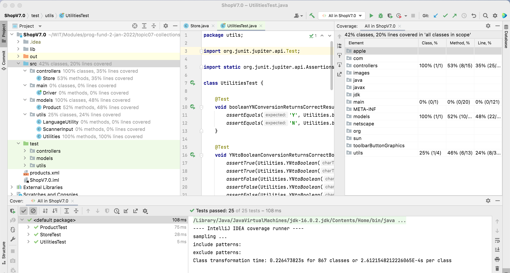

# Challenge (ShopV7.0 - Tests)

The solution for [ShopV7.0](archives/ShopV7.0.zip) is here should you need it.

Run your JUnit tests with coverage.  

You should notice that the coverage % for Product is no longer 100% due to our new methods.  Also, there is a 0% associated with the new class LanguageUtility:

 

Using your JUnit knowledge to-date, why not try add new tests to the test suite so that you coverage % increases in these two classes?

Note:  There is no solution to the tests (yet!).  It will be a lab exercise in the coming weeks and we will provide a solution then.

