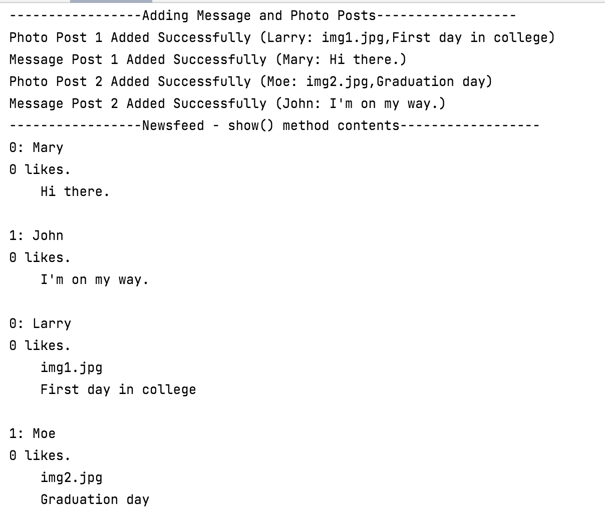

#Social Network V4.0

In this step, you will familiarise yourself with the version of the Social Network App V4.0 (without inheritance).

We won't ask you to write the code, we will just ask you to download the project and run it.  

##Downloading Social Network V4.0 Project

Download this project, [SocialNetworkV4.0.zip](archives/SocialNetworkV4.0.zip).

Open it in IntelliJ.  It may not build for you straight away, if that's the case, these steps might resolve it:

- If the Project JDK, is not defined, Setup the SDK by choosing the latest JDK that is installed on your workstation.

- From the *File* menu, select *Invalidate Caches...* and tick all the boxes in the presented window.  Then click the *Invalidate and Restart* button.

##Testing the project

In the above project, you will notice there is a Test.java file in the *test* folder.

Open this class.  It is a **test harness** and tests the app by performing the following actions:
 
- Create 2 MessagePost objects.
- Create 2 PhotoPosts objects.
- Create 1 NewsFeed object.
- Add 1 PhotoPost object to the NewsFeed object.
- Add 1 MessagePost object to the NewsFeed object.
- Add another PhotoPost object to the NewsFeed object.
- Add another MessagePost object to the NewsFeed object.
- List all messagePost and photoPosts from the NewsFeed object.

Note that it is not a JUnit Test Class.  There are no annotations, JUnit imports etc.  It is another (inferior) way of testing.

Run this test class by running **Test.main()** and interrogate the output. 

Note the order in which the posts were added.  Now note the order in which they are printed out.

Can you figure out why the order is different than the order of input?  Hint: Look at the code for the show() method in NewsFeed. 

 

##Moving onto the next version

Before moving onto the next step, ensure that you:

- understand the code in this version. 

- recognise the code duplication and the problems that it could cause.  Think briefly about the level of code required if we decided to add a new type of post, e.g. an EventPost. 

