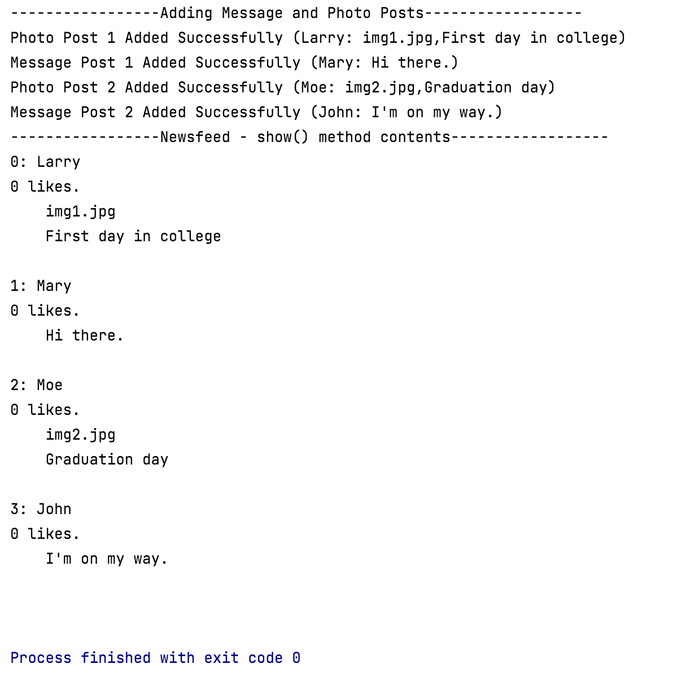

#Social Network V5.0

In this step, you will familiarise yourself with the version of the Social Network App V5.0 (with inheritance).

We won't ask you to write the code, we will just ask you to download the project and run it.  

##Downloading Social Network V5.0 Project

Download this project, [SocialNetworkV5.0.zip](archives/SocialNetworkV5.0.zip).

Open it in IntelliJ.  It may not build for you straight away, if that's the case, these steps might resolve it:

- If the Project JDK, is not defined, Setup the SDK by choosing the latest JDK that is installed on your workstation.

- From the *File* menu, select *Invalidate Caches...* and tick all the boxes in the presented window.  Then click the *Invalidate and Restart* button.

##Testing the project

In the above project, you will notice there is a Test.java file in the *test* folder. 

This **test harness** will repeat these steps that you did with the previous version:

- Create 2 MessagePost objects.
- Create 2 PhotoPosts objects.
- Create 1 NewsFeed object.
- Add 1 PhotoPost object to the NewsFeed object.
- Add 1 MessagePost object to the NewsFeed object.
- Add another PhotoPost object to the NewsFeed object.
- Add another MessagePost object to the NewsFeed object.
- List all messagePost and photoPosts from the NewsFeed object.

Note the difference in the order (the details are now printed in the order they were entered).

 

##Moving onto the next version

Before moving onto the next step, ensure that you:

- understand the code in this version. 

- recognise that we have reducted our code duplication in the app.  

- think about the level of code required if we decided to add a new type of post, e.g. an EventPost. We will be doing this in the next step.

