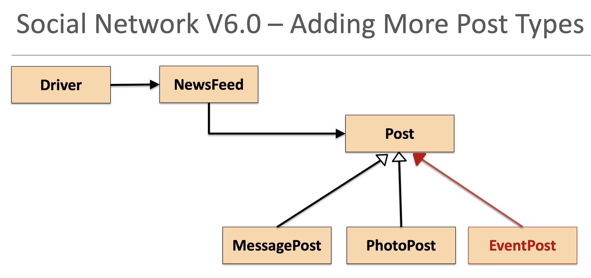
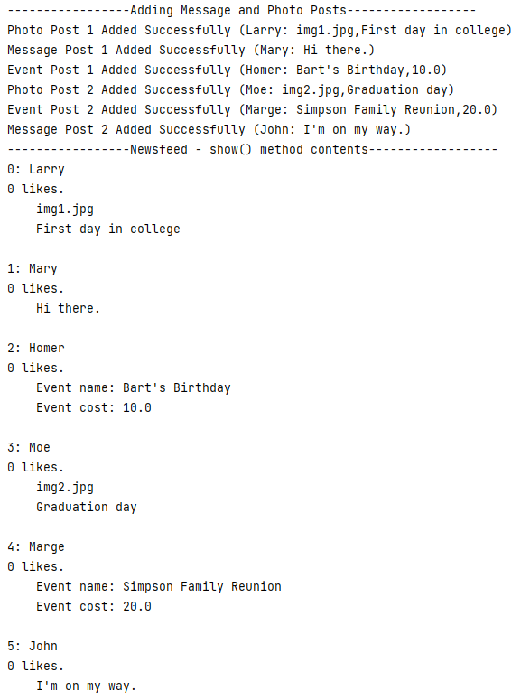

#Social Network V6.0

In this step, we will start coding - we will be adding a new Post type to this version, an EventPost.  

 

##Creating Social Network V6.0 Project

You should have previously downloaded this project, [SocialNetworkV5.0.zip](archives/SocialNetworkV5.0.zip).

Open Windows Explorer / Mac Finder and locate where your project is.  Copy the SocialNetworkV5.0 folder and paste it with the new name SocialNetworkV6.0.  

Open this new project in IntelliJ.  Once in IntelliJ, you will notice that the Project name is still SocialNetworkV5.0.  Right click on it and select **Refactor...Rename**.  Call the project SocialNetworkV6.0.

Now we are ready to start adding the new Post type, EventPost. 

##Adding EventPost

In the models package, right click and add a new class called EventPost.

In this new class, add the following functionality:

- EventPost should inherit from Post
- EventPost has two private instance fields, eventName (String) and eventCost (double).
- The EventPost constructor should take in three fields, author, eventname and eventCost.
    - author is passed to the super constructor
    - eventName is validated to 35 chars.
    - eventCost is validated as between 0 and 99999, both inclusive. 
- Accessors and mutators (with appropriate validation) should be added for both eventName and eventCost.
- A display method should return the object state from the superclass as well as the object state from the subclass.  Only include the object state from the subclass, if the eventName is not empty.

##Updating NewsFeed

In order for EventPost to be handled properly, we need to make some changes to our NewsFeed class:

- add a showEventPosts() method, modelled on the showMessagePost() method. 
- add a updateEventPost() method, modelled on the showEventPost() method.
- add a numberOfEventPosts() method, modelled on the numberOfPhotoPosts() method. 
- in the load() method, add the EventPost.class to the list of allowable classes to be serialised.
- add an isValidEventPostIndex(int index) method, modelled on the isValidPhotoPostIndex(int index) method.

##Updating Driver

In order for EventPost to be handled properly, we need to make some changes to our Driver:

- in the addPost() method, add an option **3) Add an Event Post**.  
- in the updatePost() method, add an option **3) Update an Event Post**.
- in the viewPosts() method, add an option **4) View Event Posts**.
- add a new method, showEventPosts() modelled on the showPhotoPosts() method. 

##Test the Driver

Run the Driver and test the new menu options.  Are all behaving as expected?  If not, return to the code and locate the bug and fix it. 

##Testing using the Test Harness

There should be an old test harness in your project in **tests/Test.java**.  

We want to update this now to include test for our new class, EventPost. To do this, add two new EventPosts objects and add them to NewsFeed.

When you run the code, it should look something like this:

 

Are the posts printed in the order we entered them?

##Solution Social Network V6.0 Project

The solution for [SocialNetworkV6.0.zip](archives/SocialNetworkV6.0.zip).

