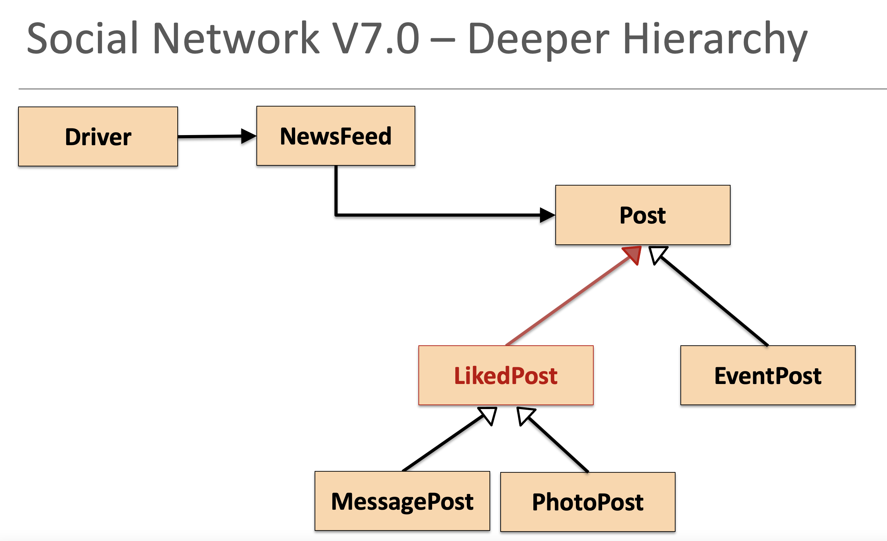
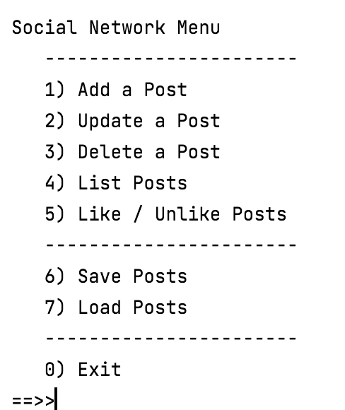
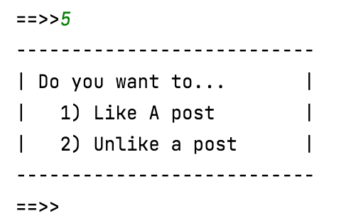
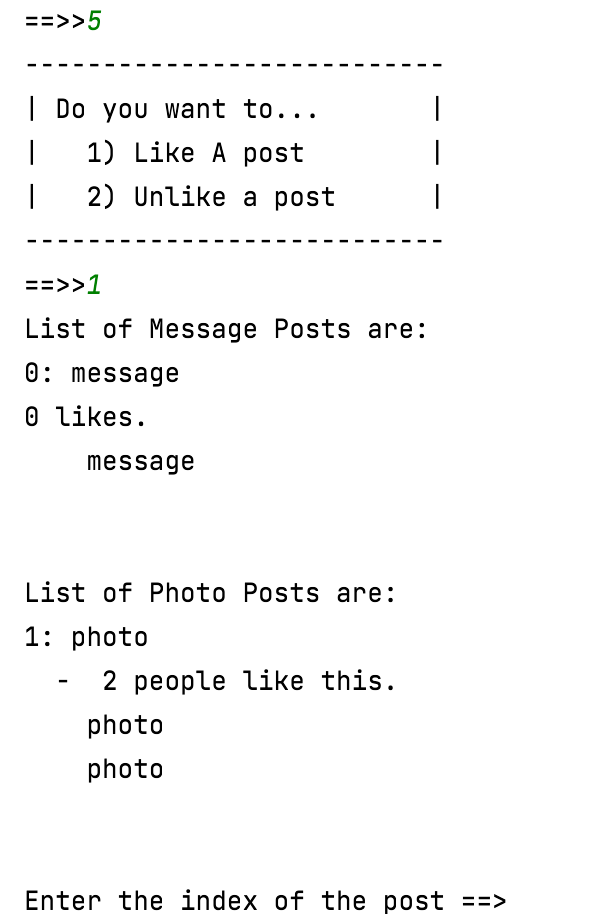
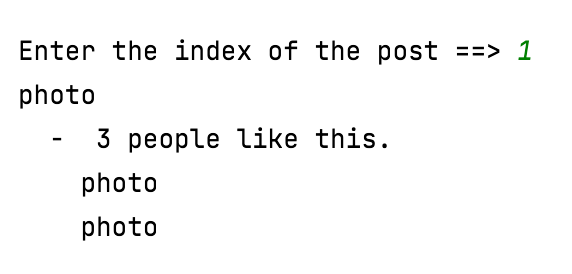

#Social Network V7.0

In this step, we will do a bit more coding - we will be creating a deeper hierarchy.  We now want to have a LikedPost class that is a sub class of Post, but a superclass to MessagePost and PhotoPost.  EventPost is a sub class of Post. 

 

##Creating Social Network V7.0 Project

Use either your V6.0 of the project or this downloadable version: [SocialNetworkV6.0.zip](archives/SocialNetworkV6.0.zip).

Open Windows Explorer / Mac Finder and locate where V6.0 is.  Copy the SocialNetworkV6.0 folder and paste it with the new name SocialNetworkV7.0.  

Open this new project in IntelliJ.  Once in IntelliJ, you will notice that the Project name is still SocialNetworkV6.0.  Right click on it and select **Refactor...Rename**.  Call the project SocialNetworkV7.0.

Now we are ready to start adding the new Post type, LikedPost. 

##Adding LikedPost

In the models package, right click and add a new class called LikedPost.

In this inheritance hierarchy, implement the following functionality:

- LikedPost should inherit from Post.

- MessagePost and PhotoPost should now inherit from LikedPost.

- Move the likes field (and it's accessor and mutator) from Post to LikedPost.

- In Post, the display method is not compiling, as the likes field is in a subclass now.  
- Add a new display method to LikedPost - this method should return the contents of the supercalss along with the likes field.
- Return back to the display method in Post and remove the code relating to the likes field.  The Post class should now compile.

- The LikedPost is not compiling as we don't have a constructor defined, one that calls the super(author).  Define this now. 

- Add two new methods:

    - likeAPost() that adds one to likes (return type is void)
    - unLikeAPost() that takes one from likes (return type is void)

##Updating NewsFeed

Now that we have our new LikedPost class in place, lets start adding functionality so that we can start liking/unliking posts.

Include this code:

~~~
    public void likeAPost(int index) {
        Post post = null;
        if (isValidIndex(index)) {
            post = posts.get(index);
            if ((post instanceof LikedPost)){
                ((LikedPost) post).likeAPost();
            }
        }
    }

    public void unLikeAPost(int index) {
        Post post = null;
        if (isValidIndex(index)) {
            post = posts.get(index);
            if ((post instanceof LikedPost)){
                ((LikedPost) post).unlikeAPost();
            }
        }
    }
~~~

##Updating Driver

In order to allow posts to be liked or unliked, we need to add a new menu option:

 

This new menu option should call a private method in Driver called likeUnlikePosts().  This new method should display a choice for the user:

 

Depending on the user choice, all message and photo posts should be displayed to the user and the user should be prompted to choose a post by index number:

 

Assuming the chosen index number is valid, the post is liked/unliked accordingly:

 

##Test the Driver

Run the Driver and test the new menu option.  Is it behaving as expected?  Is is incrementing and decrementing the likes correctly?  What happens if you unlike a post that has zero likes?  Does it stay at zero?

If your code is not behaving correctly, return to it and locate the bug and fix it. 

##Testing using the Test Harness

There should be an old test harness in your project in **tests/Test.java**.  

We want to update this now to include test for our new class, EventPost. To do this, add two new EventPosts objects and add them to NewsFeed.

When you run the code, it should look something like this:

 

Are the posts printed in the order we entered them?

##Solution Social Network V7.0 Project

The solution for [SocialNetworkV7.0.zip](archives/SocialNetworkV7.0.zip).

