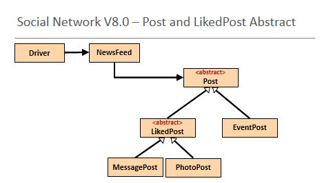

# Social Network V8.0

In this step, you will create version 8 of the Social Network App (our menu driven messaging system).  In this version, you will use abstraction in the inheritance hierarchy.

In this step, we will do a small bit more coding - in our deeper hierarchy, we will be making both Post and LikedPost abstract.  

## Creating Social Network V8.0 Project

Use either your V7.0 of the project or this downloadable version: [SocialNetworkV7.0.zip](archives/SocialNetworkV7.0.zip).

Open Windows Explorer / Mac Finder and locate where V7.0 is.  Copy the SocialNetworkV7.0 folder and paste it with the new name SocialNetworkV8.0.  

Open this new project in IntelliJ.  Once in IntelliJ, you will notice that the Project name is still SocialNetworkV7.0.  Right click on it and select **Refactor...Rename**.  Call the project SocialNetworkV8.0.

Now we are ready to start adding the new Post type, LikedPost. 

## Post - Abstract Class and Abstract Method

Make the Post class abstract by adding `abstract` to the class definition.  This means that we can no longer create an object (instantiate) of Post...we can only create objects of it's concrete subclasses.

Now add the following abstract method to Post:

~~~
public abstract String displayCondensed();
~~~

Note there is no body associated with an abstract method.  Any class that extends the Post class MUST provide the method body (i.e. the implementation) for this method OR make itself abstract. 

You will start noticing that there are errors appearing in MessagePost, EventPost, PhotoPost and LikedPost.  This is because we haven't provided the implentation for the new abstract method yet. 

## EventPost

Add the following implementation of this abstract method into EventPost:

~~~
    @Override
    public String displayCondensed() {
        return super.getAuthor() + ": Event(" + eventName + ", €" + eventCost + ")";
    }
~~~

Now the compile errors should be gone for this class.  

## MessagePost

And now add the implementation to MessagePost:

~~~
    @Override
    public String displayCondensed() {
        return super.displayCondensed() + ": Message(" + message +  ")";
    }
~~~

 
## PhotoPost

And finally, add the implementation to PhotoPost:

~~~
    @Override
    public String displayCondensed() {
        return super.displayCondensed() + ": Photo(" + caption +  ", " + filename + ")";
    }
~~~

## LikedPost

We are going to make this class `abstract` too, so add the keyword abstract to the class definition. 

We also want to output the "likes" info to the user, so we will provide a method implementation for the Post abstract method here:

~~~
    @Override
    public String displayCondensed() {
        if(likes > 0) {
            return super.getAuthor() + " (" + likes + " likes) ";
        }
        else {
            return super.getAuthor() + " (0 likes) ";
        }
    }
~~~

We have now made two classes abstract (Post and LikedPost) and also provided the implementation of the new abstract method, displayCondensed(), in the hierarchy.

In the next step, we will refactor the NewsFeed class to use this new method.

