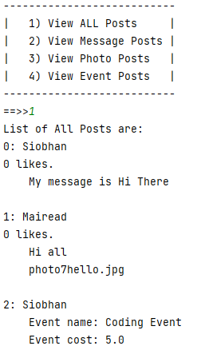
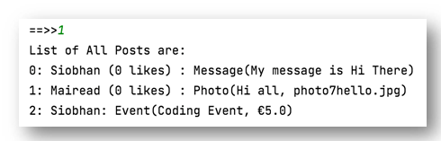

# Social Network V8.0 - NewsFeed

In this step, we will use the new displayCondensed() method when listing ALL the posts.

Currently, when we select View ALL Posts, they are listed like this:

## NewsFeed

In your NewsFeed class, the current show() method is like this:

~~~
    public String show() {
        String str = "";

        for(Post post: posts) {
            str += posts.indexOf(post) + ": " + post.display() + "\n";
        }

        if (str.isEmpty()){
            return "No Posts";
        }
        else {
            return str;
        }
    }
~~~

Refactor it to use displayCondensed() instead:

~~~
    public String show() {
        String str = "";

        for(Post post: posts) {
            str += posts.indexOf(post) + ": " + post.displayCondensed() + "\n";
        }

        if (str.isEmpty()){
            return "No Posts";
        }
        else {
            return str;
        }
    }
~~~

Now run the Driver and test the List All Posts option and your output should look like this:

