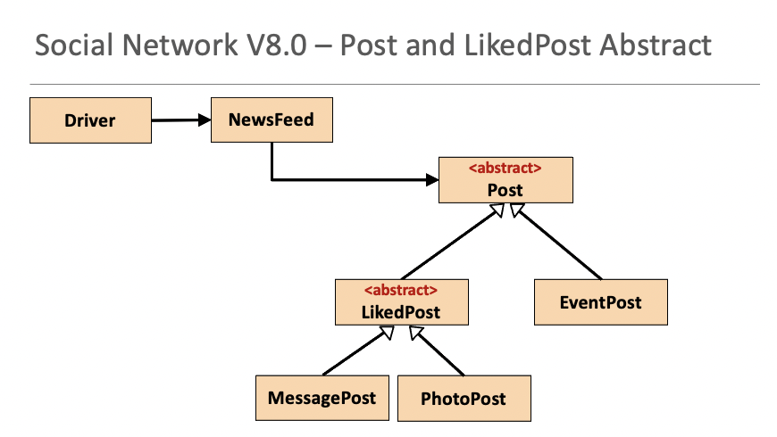

# Using Pre-defined Interfaces

In this practical, you will use the Collections Framework Interfaces in our Social Network App.

## Creating Social Network V9.0 Project

Use either your V8.0 of the project or this downloadable version: [SocialNetworkV8.0.zip](archives/SocialNetworkV8.0.zip) : 

Open Windows Explorer / Mac Finder and locate where V8.0 is.  Copy the SocialNetworkV8.0 folder and paste it with the new name SocialNetworkV9.0.  

Open this new project in IntelliJ.  Once in IntelliJ, you will notice that the Project name is still SocialNetworkV8.0.  Right click on it and select **Refactor...Rename**.  Call the project SocialNetworkV9.0.

Now we are ready to refactor our app so that our *posts* ArrayList is defined using interfaces instead of concrete classes.   This is how we have currently defined our ArrayList:

~~~
    private ArrayList<Post> posts;

    public NewsFeed() {
        posts = new ArrayList<>();
    }
~~~

## NewsFeed - Adding Getters and Setters for post ArrayList

You might have noticed that we don't have getters and setters for our *posts* ArrayList.  

Add them in (generate them in IntelliJ) now.  We want to add them in so that we really see the effects of defining our ArrayList using interfaces instead of concrete classes.  

Your generated code should look like this:

~~~
    public ArrayList<Post> getPosts() {
        return posts;
    }

    public void setPosts(ArrayList<Post> posts) {
        this.posts = posts;
    }
~~~

## Using the List Interface

In NewsFeed:

- define the **posts** ArrayList to be a List.

- import java.util.List;

- change the **posts** getter return type to List

- change the **posts** setter parameter type to List

- change the load method to cast to List and not ArrayList

Your code changes should look like this now:

~~~
    private List<Post> posts;

    public NewsFeed() {
        posts = new ArrayList<>();
    }

    public List<Post> getPosts() {
        return posts;
    }

    public void setPosts(List<Post> posts) {
        this.posts = posts;
    }
~~~

~~~
    public void load() throws Exception {
        //list of classes that you wish to include in the serialisation, separated by a comma
        Class<?>[] classes = new Class[]{EventPost.class, MessagePost.class, PhotoPost.class, Post.class};

        //setting up the xstream object with default security and the above classes
        XStream xstream = new XStream(new DomDriver());
        XStream.setupDefaultSecurity(xstream);
        xstream.allowTypes(classes);

        //doing the actual serialisation to an XML file
        ObjectInputStream in = xstream.createObjectInputStream(new FileReader("posts.xml"));
        posts = (List<Post>) in.readObject();
        in.close();
    }
~~~

Run you app and test your code to make sure your refactoring did not break anything.

## Changing to LinkedList

Now we will see the benefit of defining collections at Interface level.

We can now swap out our concrete implementation in one line of code.  This means that we can change from using ArrayList to say, a LinkedList.  

Try this now...your code change should look like this:

~~~
    public NewsFeed() {
        posts = new LinkedList<>();
    }

~~~

Add in the LinkedList import and remove the ArrayList one:

~~~
   import java.util.LinkedList;
~~~

Run your app again...it should work as expected, but instead of using an ArrayList, we are now using a LinkedList (with a one line code change!).  If we weren't defining our collections at interface level (List), we would have many more code changes to make to move to LinkedList. 

Change back to an ArrayList and move onto the next Step.

