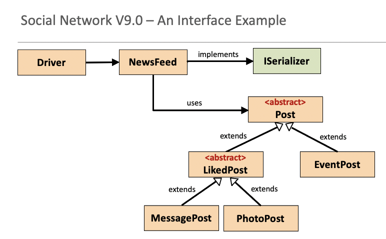
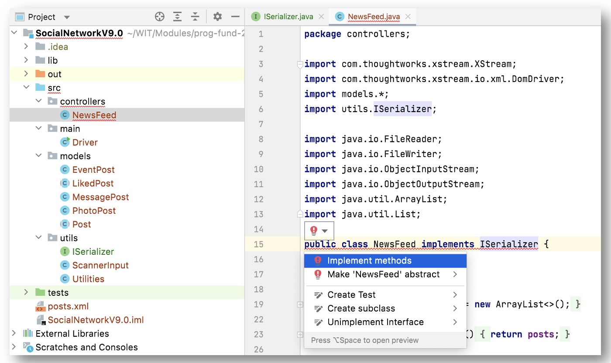

# Implementing ISerializer

In this step, you will create the *ISerializer* interface and implement it in NewsFeed. 

## Creating ISerializer.java

Within the **src/utils** folder, create a new Interface called **ISerializer.java**.  If you don't see the option to create an interface, create a new *Java Class* and when the dialog box appears, choose *Interface* as the *kind* from the drop-down box.

Add the following abstract methods into the Interface:

~~~java

    void save() throws Exception;
    void load() throws Exception;
    String fileName();

~~~

Any class implementing this new interface will have to provide concrete implementations fo reach of these abstract methods, if they haven't provided them already.  This is how we can force a class to adhere to a design we want i.e. code to contract.

## Updating NewsFeed.java

Implement the ISerializer interface in the NewsFeed class i.e.

~~~java
public class NewsFeed implements ISerializer
~~~

You will notice immediately that IntelliJ starts complaining...we either need to make the Newsfeed class abstract, or provide a concrete implemention for each method listed in the interface:

Previously, our code contained these concrete methods:

- void save() throws Exception;
- void load() throws Exception;

So IntelliJ isn't complaining about these.  However, there is no concrete implementation for this method:

- String fileName();

We will now provide an implementation for this method (note you can select the *implement method* option displayed when you hover over the red light bulb - this will create a method stub for you):

~~~java
    @Override
    public String fileName() {
        
    }
~~~

Add the code to return the fileName "posts.xml" i.e.:

~~~
    public String fileName(){
        return "posts.xml";
    }
~~~

## Updating Driver.java

We can use this new method when saving and loading in the Driver; we can tell the user what the filename is.

To do this, update the Driver, loadPosts() method to:

~~~
    //load all the posts into the newsFeed from a file on the hard disk
    private void loadPosts() {
        try {
            System.out.println("Loading from file: " + newsFeed.fileName());
            newsFeed.load();
        } catch (Exception e) {
            System.err.println("Error reading from file: " + e);
        }
    }
~~~

And the savePosts() method to:

~~~
    //save all the posts in the newsFeed to a file on the hard disk
    private void savePosts() {
        try {
            System.out.println("Saving to file: " + newsFeed.fileName());
            newsFeed.save();
        } catch (Exception e) {
            System.err.println("Error writing to file: " + e);
        }
    }
~~~

Run your app again, and try saving and loading...the filename should now be displayed.  

Save your work.