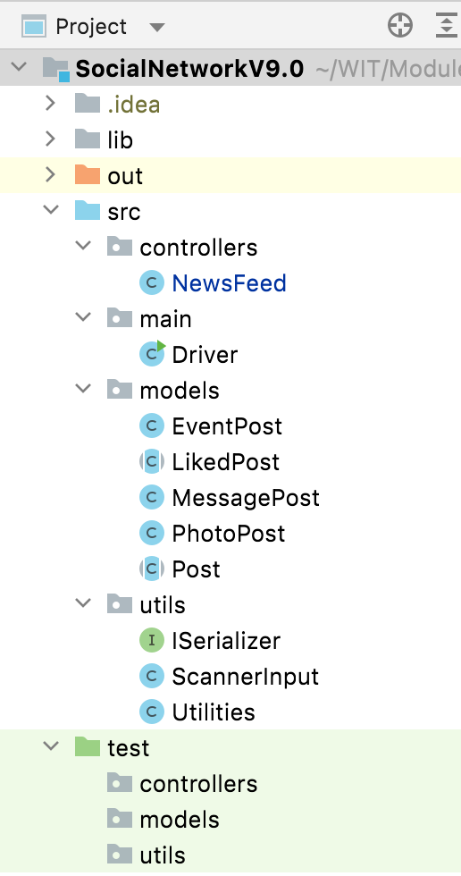
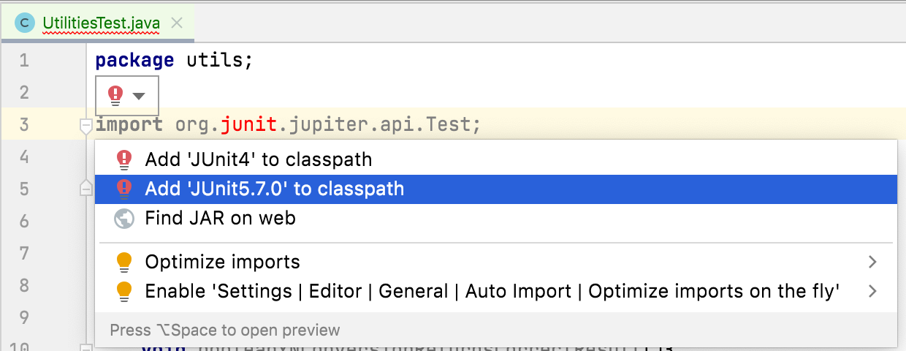

# JUnit - MessagePost

We will now turn our attention to JUnit and testing Hierarchies with Abstraction. 

If you still have a Test Harness class in your V9 project, you can just delete it.  We will be using JUnit for this testing.

## Test directory

If you haven't got a **test** folder in your project, create one now and mark the directory as **Test Sources Root**.

In your **test** folder, replicate your package structure that is in **src**. 

Your folder structure should now look like this:

## UtilitiesTest

We previously wrote a UtilitiesTest class (for Shop).  We can now reuse that test class here.  In **test/utils**, create a new Java Class and copy this code into it:

~~~
package utils;

import org.junit.jupiter.api.Test;

import static org.junit.jupiter.api.Assertions.*;

class UtilitiesTest {

    @Test
    void validRangeWorksWithPositiveTestData(){
        assertTrue(Utilities.validRange(1, 1, 1));
        assertTrue(Utilities.validRange(1, 1, 2));
        assertTrue(Utilities.validRange(1, 0, 1));
        assertTrue(Utilities.validRange(1, 0, 2)) ;
        assertTrue(Utilities.validRange(-1, -2, -1)) ;
    }

    @Test
    void validRangeWorksWithNegativeTestData(){
        assertFalse(Utilities.validRange(1,0,0));
        assertFalse(Utilities.validRange(1,1,0));
        assertFalse(Utilities.validRange(1,2,1));
        assertFalse(Utilities.validRange(-1, -1, -2)) ;
    }
    
    @Test
    void truncateStringMethodTrucatesCorrectly(){
        assertEquals("123456789", Utilities.truncateString("1234567890", 9));
        assertEquals("1234567890", Utilities.truncateString("1234567890", 10));
        assertEquals("1234567890", Utilities.truncateString("1234567890", 11));
        assertEquals("", Utilities.truncateString("1234567890", 0));
        assertEquals("", Utilities.truncateString("", 0));
        assertEquals("", Utilities.truncateString("", 10));
    }
}
~~~

Immediately, we will have syntax errors on our asserts, etc.   To resolve this, we need to add JUnit5 to our build path.  You can do this by clicking on the red light bulb and selecting the JUnit5 option:

Run these tests to make sure that you get all green ticks (i.e. no tests failed).

## Testing the Hierarchy

In the **test/models** package, we will create test classes for the concrete classes in our hierarchy e.g.:

- EventPostTest
- MessagePostTest
- PhotoPostTest

It is through these classes that we will test the absract classes, LikedPost and Post.  

Remember, we cannot create objects of abstract classes and this is why we will do the testing via the concrete classes that comeplete them.

## MessagePostTest - Getters

In the MessagePostTest class, add the following test fixture data:

~~~
    private MessagePost messagePostBelow, messagePostExact, messagePostAbove, messagePostZero;

    @BeforeEach
    void setUp() {
        //author 9 chars, message 39 chars 
        messagePostBelow = new MessagePost("Mairead M", "Programming fundamentals assignment due");
        //author 10 chars, message 40 chars 
        messagePostExact = new MessagePost("SiobhanDro", "Objects and Classes Lecture starting now");
        //author 11 chars, message 41 chars 
        messagePostAbove = new MessagePost("SiobhanRoch", "Computing and Maths Centre open from 9am.");
        //author 0 chars, message 0 chars 
        messagePostZero = new MessagePost("", "");
    }

    @AfterEach
    void tearDown() {
        messagePostBelow = messagePostExact = messagePostAbove = messagePostZero = null;
    }
~~~

This data will test at the validation boundaries for the author and message.  It will also test that the class can handle the "existance of nothing" i.e. empty Strings being passed for author and message. 

Now add a nested class called Getters that will have three methods (only one is completed): 

~~~
    @Nested
    class Getters {

        @Test
        void getMessage() {
            assertEquals("Programming fundamentals assignment due", messagePostBelow.getMessage());
            assertEquals("Objects and Classes Lecture starting now", messagePostExact.getMessage());
            assertEquals("Computing and Maths Centre open from 9am", messagePostAbove.getMessage());
            assertEquals("", messagePostZero.getMessage());
        }

        @Test
        void getAuthor() {
        }

        @Test
        void getLikes() {
        }

    }
~~~

Note how we are testing the getMessage() method for each of our objects in the text fixture.  Run this test method and it should pass.

Now complete the getAuthor() code, based on the approach used for getMessage().  

Then complete the getLikes() code, making sure each of the four objects has a default likes value of 0.

Run these tests; they should all pass.

## MessagePostTest - Setters

Continuing in the MessagePostTest class, add the folllowing nested class called Setters that will have three methods (again, only one is completed): 

~~~
    @Nested
    class Setters {

        @Test
        void setMessage() {
            assertEquals("Programming fundamentals assignment due", messagePostBelow.getMessage());

            messagePostBelow.setMessage("Programming fundamentals results -- out");   //39 chars - update performed
            assertEquals("Programming fundamentals results -- out", messagePostBelow.getMessage());

            messagePostBelow.setMessage("Programming fundamentals results are out");   //40 chars - update performed
            assertEquals("Programming fundamentals results are out", messagePostBelow.getMessage());

            messagePostBelow.setMessage("Programming fundamentals module now over!");   //41 chars - update ignored
            assertEquals("Programming fundamentals results are out", messagePostBelow.getMessage());
        }

        @Test
        void setAuthor() {
        }

        @Test
        void setLikes() {
        }

    }
~~~

Read the above test and make sure you understand what's happening.  Run the test; it should be successful.

Then write similar test for both the setAuthor() and setLikes().  Run the tests and if they aren't passing, return to the code and troubleshoot the issue.

Did you notice, when testing setLikes(), that you could set your likes to anything you wanted, even preposterous values like -23143.  We've uncovered a design issue in our code based.  Really we should have a check in our setLikes() to make sure that we only update the likes field if the value is 0 or more and maybe capped at 10,000.  You can add that code in and update your tests accordingly. 

## MessagePostTest - Display

Now let's turn our attention to the two display methods.  Add in the following to test the display() method:

~~~
    @Nested
    class DisplayMethods {

        @Test
        void testDisplay() {
            //testing the display when a post has no likes
            String toStringContents = messagePostExact.display();
            assertTrue(toStringContents.contains(messagePostExact.getAuthor()));
            assertTrue(toStringContents.contains(messagePostExact.getMessage()));
            assertTrue(toStringContents.contains("0 likes"));

            //testing the display when a post has likes
            messagePostExact.setLikes(1);
            assertTrue(messagePostExact.display().contains("1 people like this"));
        }
        
        @Test
        void testDisplayCondensed(){
            
        }
    }
~~~

Run the testDisplay() method and your test should pass.  Note how we are testing two paths in it...one when the MessagePost has zero likes and one when it has 1 like. 

Now try write the testDisplayCondensed() method (i.e. for testing displayCondensed()) and run it.  
