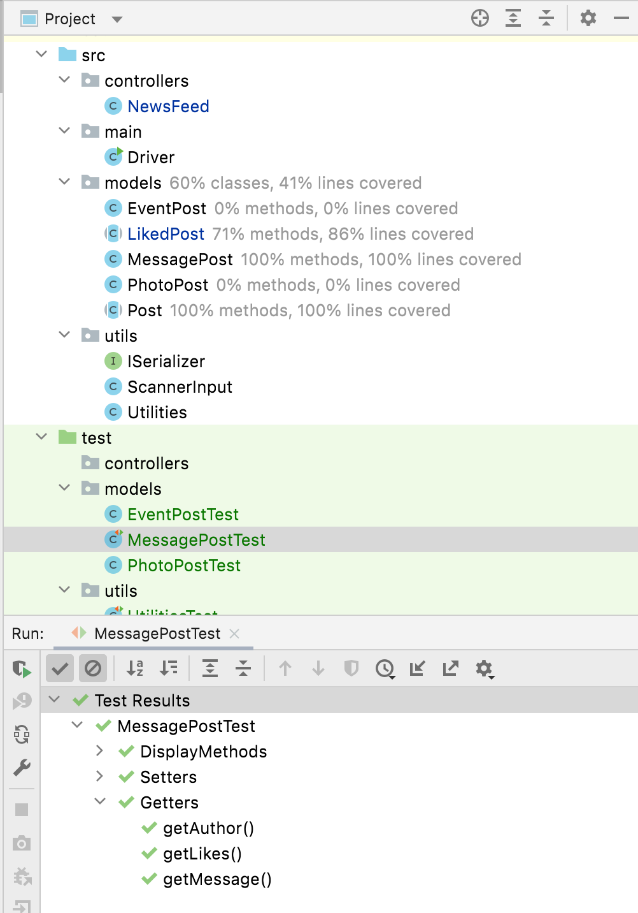
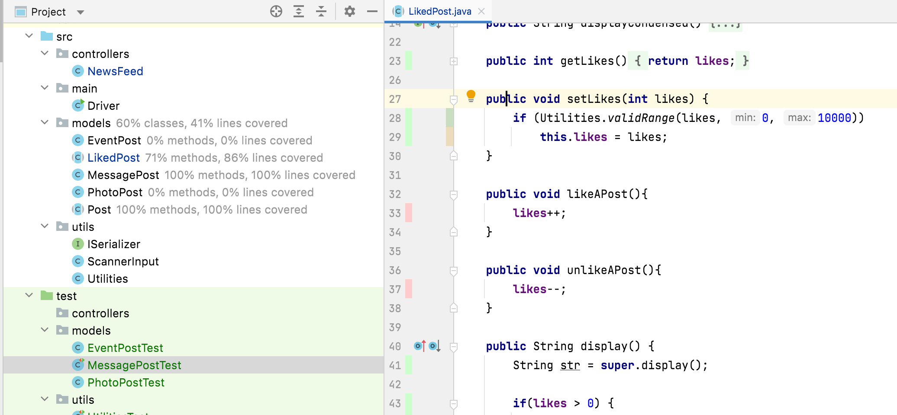

# JUnit Coverage

Now that we have written a good few tests, we want to see how much of our code is tested by our JUnit tests.  This is called code coverage. 

## MessagePostTest - Coverage Report

Assuming your tests run successfully, run ALL the tests in the MessagePostTest class, this time with Coverage.    

You should now see that the Post class is 100% tested, as is the MessagePost class.  However, we have missed some methods in LikedPost as we only have 71% coverage:

When we look at the LikedPost code, we can see the methods we have missed (they are marked with a pink line):

## MessagePostTest - Like and Unlike

Currently, these two methods haven't been tested:

~~~
   public void likeAPost(){
        likes++;
    }

    public void unlikeAPost(){
        likes--;
    }
~~~

Let's create a new nested class category called LikesOnPosts with the following two method stubs in it:

~~~
    @Nested
    class LikesOnPosts {

        @Test
        void testingLikingOfPosts() {

        }

        @Test
        void testingUnLikingOfPosts() {

        }
    }
~~~

In the method, testingLikingOfPosts() add code that will test this approach:

- verify that the likes for messagePostExact is 0
- call likeAPost() over messagePostExact
- verify that the likes for messagePostExact is now 1
- call likeAPost() over messagePostExact
- verify that the likes for messagePostExact is now 2

In the method, testingUnLikingOfPosts() add code that will test this approach:

- verify that the likes for messagePostExact is 0
- call unLikeAPost() over messagePostExact
- verify that the likes for messagePostExact is still 0
- call setLikes() over messagePostExact with a value of 2
- verify that the likes for messagePostExact is now 2
- call unLikeAPost() over messagePostExact
- verify that the likes for messagePostExact is now 1

Run your new tests.  

You will notice that the first one is succsssful, however the second one fails.  We have uncovered a bug...we can have minus likes.  However, we should not let the likes drop below 0.   

Return to your LikedPost class and make the change so that unLikeAPost() will not reduce below zero. 

Now run your test again; this time it should pass.

Now run all the MessagePost tests with coverage to verify that you have 100% coverage in MessagePost, LikedPost and Post.

## More models tests

Now that you have full coverage on your MessagePost hierarchy, you could try apply this knowledge to ***EITHER***:

- the EventPostTest and PhotoPostTest classes ***OR*** 
- the model classes in your current assignment. 

Note: there is no soloution to the EventPostTest and PhotoPostTest classes as they are very similar in approach to MessagePost.

