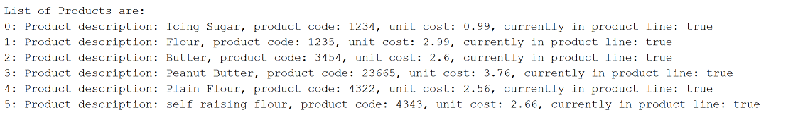
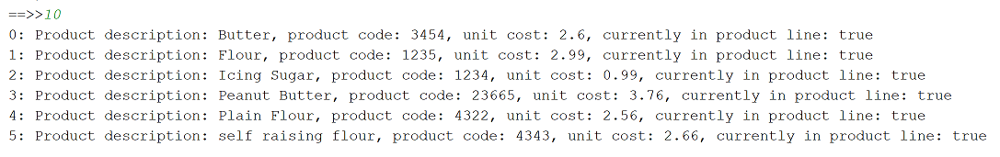

# Sorting

In this step, we will add the code for the sorting.  We want to be able to PHYSICALLY sort the order of the ArrayList by product name ascending.

## Coding the Sort

Again, as the products ArrayList is in the Store class, you will need to write the sort method in there. 

Add the following methods to Store.java.  This is the selection sort algorithm:

~~~
    public void sortProductsByNameAscending()
    {
        for (int i = products.size() -1; i >= 0; i--)
        {
            int highestIndex = 0;
            for (int j = 0; j <= i; j++)
            {
                if (products.get(j).getProductName().compareTo(products.get(highestIndex).getProductName()) > 0) {
                    highestIndex = j;
                }
            }
            swapProducts(products, i, highestIndex);
        }
    }

    private void swapProducts(ArrayList<Product> employees, int i, int j) {
        Product smaller = products.get(i);
        Product bigger = products.get(j);

        products.set(i,bigger);
        products.set(j,smaller);
    }
~~~

Now return to the Driver and update the sortProductByName() to be:

~~~
    private void sortProductByName() {
        store.sortProductsByNameAscending();
        System.out.println(store.listProducts());
    }    
~~~

## Testing the sort

Run the app and add product names similar to this (if you saved them in the previous step, you can load them from your XML file):

 

Now test the sort.  Your products arraylist should be now sorted by product name ascending:

 

